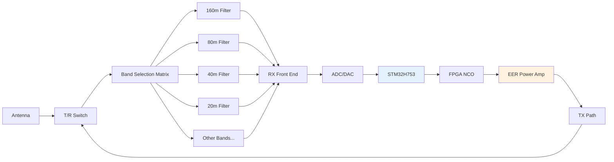
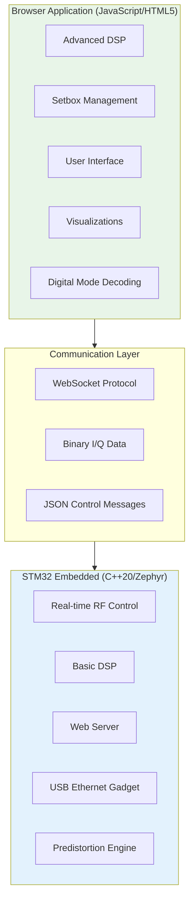
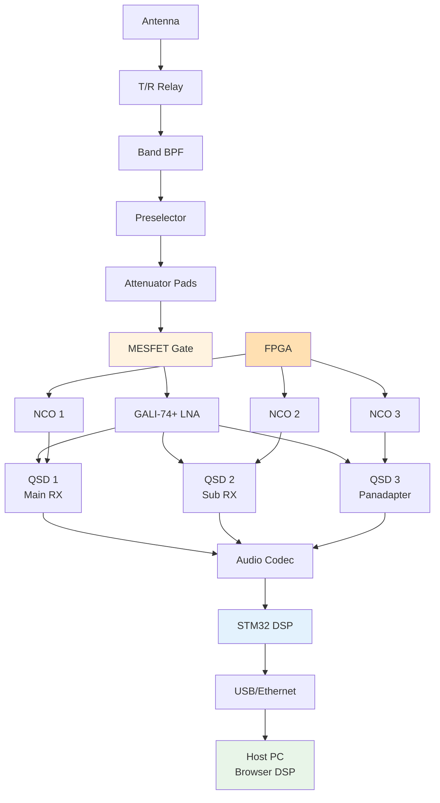
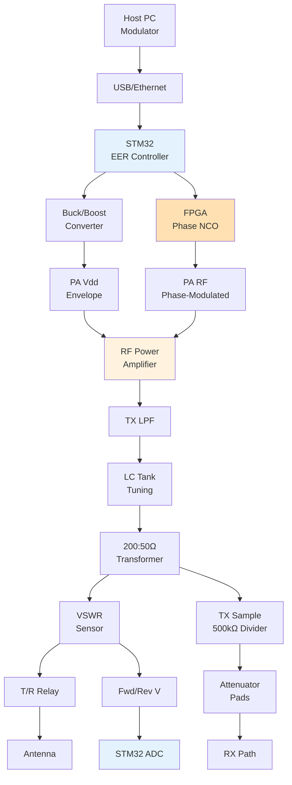

# NexRig: Technical Architecture
## Hardware, Software, and RF Design

### Hardware Architecture

The NexRig hardware platform centers around an STM32H753
microcontroller - a 480MHz Cortex-M7 processor with 1MB of both flash
memory and RAM. This isn't overkill; real-time RF control, web
serving, and DSP processing demand serious computational resources.

The RF section covers all ten HF amateur bands from 160 meters down to
10 meters, using relay and pHEMT FET switching for band selection and
transmit/receive switching. Each band gets its own order-5 Chebyshev
bandpass filter rated for the full 50-watt output power. The result is
excellent harmonic suppression and band isolation without the
complexity of mechanical switching.



Power management deserves special attention. The system operates from
12V DC at up to 10 amperes, providing 120 watts total system power.
The transmit path uses envelope elimination and restoration (EER)
architecture, where a tracking buck/boost converter modulates the
power amplifier's supply voltage to create amplitude modulation, while
an FPGA-based numerically controlled oscillator (NCO) handles phase
modulation.

This EER approach achieves high efficiency even with complex
modulation schemes by eliminating the traditional linear amplifier's
constant high-voltage operation. Instead, the PA supply tracks the
envelope of the desired output signal, dramatically reducing power
consumption and heat generation.

### Host PC Interface

The transceiver connects to a host PC running the browser-based
interface through one of two physical connection options:

**USB 2.0 High-Speed (480 Mbps)**: The STM32 operates as a USB
ethernet gadget, presenting a standard network interface to the host
without requiring driver installation. This works seamlessly across
Windows, macOS, and Linux systems.

**Gigabit Ethernet**: Direct Ethernet connection provides higher
bandwidth and longer cable runs, particularly useful for remote
installations or multi-operator stations. Implementation planned for
future software releases.

Both interfaces carry identical data streams using the same protocol
layer. The system streams three independent stereo (I/Q) channels at
96 kS/s with 24-bit resolution from the three quadrature sampling
detectors to the host. The host PC handles the majority of DSP
processing - demodulation, filtering, digital mode decoding, and the
user interface - while the STM32 maintains real-time RF control and
basic signal conditioning.

The host can be a laptop, desktop computer, or single-board computer
like a Raspberry Pi. The only requirement is a modern web browser
(Chrome, Edge, or Safari) capable of running the JavaScript-based
interface.

### Software Architecture

The software stack divides responsibilities between the embedded
system and the browser application, with each handling what it does
best.



**Embedded System Responsibilities**: The STM32 handles everything
that requires hard real-time performance or direct hardware control.
This includes RF switching sequences, power amplifier protection,
anti-aliasing filtering, and the predistortion system that maintains
transmit signal quality. The embedded system also serves as a USB
ethernet gadget with an integrated captive portal, eliminating driver
installation requirements.

**Browser Application Responsibilities**: The browser handles
computationally intensive DSP operations, user interface management,
and all the setbox inheritance logic. Modern browsers provide
excellent performance for these tasks, and the development environment
is far more accessible than embedded programming for most
contributors.

The communication between these systems uses WebSocket protocols (or
WebRTC for future Ethernet implementation) with binary framing for I/Q
data streams and JSON messaging for control and status information.
Three independent stereo I/Q channels flow at 96 kS/s with 24-bit
resolution (approximately 13.8 Mbps total), while audio input to the
transmitter uses 48 kS/s amplitude and phase samples. The total
bandwidth requirement fits comfortably within USB 2.0's 480 Mbps
capacity with substantial headroom for control data and future
expansion.

### Receiver Architecture

The receive path implements a sophisticated three-receiver
architecture using independent quadrature sampling detectors (QSDs).
Each QSD operates as a direct-conversion mixer, producing I and Q
baseband signals that capture both amplitude and phase information of
the RF signal. The three receivers operate simultaneously, each with
independent frequency tuning controlled by separate FPGA-generated
local oscillator signals.

**Three-Receiver Configuration:**
- **Main Receiver**: Primary operating frequency with full DSP
  processing
- **Sub-Receiver**: Independent monitoring of different frequency
  (split operation, net monitoring)
- **Panadapter**: Wide-bandwidth spectrum display and waterfall
  visualization



**Signal Path Components:**

The **preselector** provides digitally-tuned input bandpass filtering
ahead of the attenuators. Controlled via I2C from the STM32, it uses
varactor diodes or switched capacitors to optimize front-end
selectivity based on the operating frequency. This reduces
out-of-band interference and improves dynamic range.

The **attenuator pad array** consists of multiple switched attenuator
stages providing 0-31 dB of attenuation in 1 dB steps. The STM32
calculates required attenuation based on signal strength measurements
from the I/Q data, implementing automatic gain control (AGC). The
attenuators prevent overload of the GALI-74+ LNA and the QSD mixers
during strong signal conditions.

The **MESFET gate** acts as a fast RF switch ahead of the LNA. During
transmit operations, it protects the sensitive LNA from TX leakage.
During QSK (full break-in CW) operation, the gate opens between
transmitted elements (between dits and dahs) allowing reception of
other stations' signals with minimal delay. The gate opening/closing
timing is coordinated with the T/R relay and PA drive to enable true
full break-in operation.

**AGC Implementation:**

AGC operates as a hybrid hardware/software system optimized for both
fast protection and smooth user experience:

1. **STM32 Fast Loop**: Measures I/Q signal strength every sample
   period, switches attenuator pads within microseconds to prevent
   overload
2. **Host PC Smoothing**: Applies gain compensation in DSP so the
   operator perceives smooth signal level changes rather than abrupt
   attenuator switching
3. **Attack/Decay**: Fast attack on strong signals (prevent overload),
   slow decay to avoid pumping on fading signals
4. **Setbox Control**: AGC characteristics (attack time, decay time,
   hang time, target level) configurable via setbox inheritance

The three QSD outputs feed into a multi-channel audio codec that
digitizes the six audio-rate signals (three I/Q pairs) at 96 kS/s with
24-bit resolution. This baseband data flows to the STM32 for basic
conditioning before transmission to the host PC for advanced DSP
processing.

### Transmitter Architecture

The transmit path implements envelope elimination and restoration
(EER) architecture, separating the signal into amplitude and phase
components for efficient amplification.



**EER Modulation Process:**

The host PC's modulator generates amplitude and phase samples at 48
kS/s. The STM32 receives these samples and splits them into two
control paths:

1. **Amplitude Path**: Commands the buck/boost tracking converter to
   modulate the PA's supply voltage (Vdd). The converter follows the
   envelope of the desired signal, providing only the instantaneous
   power needed for the current amplitude. This dramatically improves
   efficiency compared to linear amplification.

2. **Phase Path**: Commands the FPGA's NCO to generate a
   phase-modulated RF carrier. This constant-amplitude signal drives
   the PA's input.

The PA operates as a highly efficient switching or near-switching
amplifier, modulated by its varying supply voltage to produce the
final amplitude-and-phase-modulated RF output.

**Transmit Signal Sampling:**

A critical feature enables comprehensive calibration and monitoring: a
massive 500kΩ:50Ω resistive divider samples the TX output at the
antenna side of the impedance transformer. This heavily attenuated
signal (approximately -80 dB) routes through the same attenuator pad
array used for receive, then into the receive chain's QSDs.

During transmission, the MESFET gate disconnects the antenna from the
RX path, and the TX sample connects instead. The receiver can then
analyze the actual transmitted signal for:
- Digital pre-distortion (DPD) calibration
- TX amplitude lag measurement and compensation
- FPGA phase lag measurement and compensation  
- Transmit passband response calibration
- Receiver passband calibration (using known TX signal)
- Transmit spectrum monitoring and quality verification

**Transmit/Receive Switching:**

The T/R relay handles high-power switching between transmit and
receive modes. The relay switches only when the PA is completely
disabled (no gate drive, no EER supply voltage), eliminating hot
switching and allowing use of standard signal relays without special
high-current ratings. The relays only need voltage insulation, not
current handling capacity.

For QSK (full break-in CW) operation, the system maintains the T/R
relay in transmit position for an adjustable timeout period (default
~1 second, user-configurable via setbox properties). Between CW
elements, the PA remains disabled and the MESFET gate opens, allowing
the receiver to hear other stations' signals with minimal delay. This
enables true full break-in operation where you hear between your own
dits and dahs.

**Transmit Path I2C Control:**

The STM32 controls multiple transmit path components via I2C:
- **TX LPF Selection**: Switches appropriate low-pass filter for
  transmit band
- **LC Tank Tuning**: Adjusts digitally-tuned matching network for
  optimal power transfer
- **Band-specific Optimization**: Coordinates filter and tuning
  selections based on operating frequency

**VSWR Monitoring:**

Forward and reverse voltage sensors (detailed in
vswr-measurement-design.md) provide continuous monitoring of antenna
match. The STM32's ADC samples AntFwdV and AntRevV signals, enabling:
- Real-time VSWR calculation and display
- Automatic power reduction on high VSWR
- Forward power measurement for calibration
- Validation of PA output during DPD calibration

### FPGA Subsystem

The FPGA serves as the high-speed signal processing and clock
generation hub, handling tasks requiring precise timing and high-speed
logic.

**Master Clocking:**

A 30 MHz temperature-compensated crystal oscillator (TCXO) provides
the master timebase. This TCXO produces a "clipped sine wave" output,
but the FPGA input is configured as a Schmitt-triggered input,
cleaning up the lazy edges into a proper digital clock signal.

From this 30 MHz reference, the FPGA synthesizes all system clocks:

```
30 MHz TCXO
    ↓
┌───────────────┐
│  FPGA PLL/DCM │
└───────────────┘
    ├──→ NCO 1 Clock (QSD 1 LO)
    ├──→ NCO 2 Clock (QSD 2 LO) 
    ├──→ NCO 3 Clock (QSD 3 LO)
    ├──→ TX Phase NCO Clock
    ├──→ Audio Codec Master Clock (24.576 MHz for 96kS/s)
    └──→ STM32 External Clock (precise timing for USB/Ethernet)
```

**Numerically Controlled Oscillators (NCOs):**

The FPGA implements four independent NCOs:

1. **RX NCO 1**: Generates local oscillator for main receiver QSD
2. **RX NCO 2**: Generates local oscillator for sub-receiver QSD
3. **RX NCO 3**: Generates local oscillator for panadapter QSD
4. **TX NCO**: Generates phase-modulated carrier for transmit path

Each NCO provides precise frequency synthesis with fine resolution
(sub-Hz tuning) and fast switching. Phase modulation for SSB and
digital modes occurs in the TX NCO, where phase accumulator input
comes from the STM32's modulation stream.

**Boot and Clock Sequencing:**

The STM32 manages system initialization with a fallback strategy for
FPGA configuration failures:

1. **STM32 boots on internal high-speed oscillator** (64 MHz HSI)
2. **STM32 checks FPGA configuration status**
3. **If FPGA configured**: Switch to FPGA-provided precise external
   clock
4. **If FPGA failed**: Load bitstream from SD card, configure FPGA via
   SPI/JTAG
5. **After configuration**: System reset, retry boot sequence
6. **Normal operation**: STM32 runs on FPGA clock, enabling precise
   USB/Ethernet timing

This approach solves the chicken-and-egg problem (STM32 needs clock
but controls FPGA, FPGA provides clock but needs configuration) while
providing recovery from FPGA configuration corruption.

### STM32 Subsystem

The STM32H753 microcontroller orchestrates all real-time control and
serves as the bridge between RF hardware and host PC.

**Peripheral Usage:**

**ADC Channels:**
- **AntFwdV**: Forward voltage from VSWR sensor (transmit power
  measurement)
- **AntRevV**: Reverse voltage from VSWR sensor (reflected power
  measurement)
- **Temperature Sensors**: PA temperature, bias supply monitoring
- **Supply Voltages**: Power supply health monitoring

**I2C Buses:**
- **RX Preselector**: Digitally-tuned input filter control
- **TX LPF Selection**: Transmit low-pass filter band switching
- **TX LC Tank Tuning**: Output matching network optimization
- **Power Management ICs**: Voltage regulator configuration (if used)

**SPI Interfaces:**
- **Audio Codec**: Six-channel (3 × I/Q) data transfer at 96 kS/s
- **FPGA Configuration**: Bitstream loading and reconfiguration
- **High-speed peripherals**: Future expansion

**SD Card (SDIO/SPI):**
- **Configuration Storage**: Setbox configurations, user preferences
- **Audio Recording**: QSO recordings, voice memories
- **Log Files**: Contact logs, system event logging
- **Firmware Updates**: Staging area for STM32 and FPGA firmware
- **FPGA Bitstreams**: Recovery images for FPGA reconfiguration
- **Host Access**: Files accessible from host PC via USB/Ethernet

**USB/Ethernet:**
- **Primary Interface**: USB 2.0 High-Speed Ethernet gadget (480 Mbps)
- **Future Interface**: Native Ethernet with precise timing from FPGA
  clock
- **Protocol Support**: WebSocket (USB), WebRTC or similar (Ethernet)

**Real-time Control Tasks:**

The STM32 runs Zephyr RTOS managing multiple concurrent tasks:
- RF switching coordination (T/R relay, MESFET gate, attenuators)
- AGC fast loop (signal strength → attenuator control)
- PA protection (temperature, VSWR, drive limits)
- Power sequencing (startup and shutdown coordination)
- DPD preprocessing (timing compensation tables)
- I/Q data conditioning and formatting
- Command processing from host PC

### Calibration and Compensation Systems


### Calibration and Compensation Systems

The transceiver implements multiple interrelated calibration systems
that work together to maintain signal quality and measurement
accuracy.

**Digital Pre-Distortion (DPD):**

DPD compensates for nonlinearities in the transmit chain, primarily
the power amplifier. The TX sampling path provides feedback for
continuous monitoring and correction:

1. **Signal Capture**: TX sample (via 500kΩ divider → attenuators →
   RX chain) captures actual PA output
2. **Comparison**: Compare actual output against intended signal from
   modulator
3. **Characterization**: Build lookup tables of PA nonlinearities
   across power levels and frequencies
4. **Compensation**: Pre-distort input signal to cancel PA
   nonlinearities
5. **Adaptation**: Continuously update corrections based on
   temperature, frequency, power level

**Timing Alignment:**

The EER architecture requires precise time-alignment between amplitude
and phase modulation paths. Misalignment causes distortion and
splatter:

- **Amplitude Lag**: Buck/boost converter has finite response time
  (typically 1-10 µs)
- **Phase Lag**: FPGA NCO has pipeline delays and finite transition
  time
- **Measurement**: TX sampling path captures actual timing
  relationship
- **Calibration Tables**: Store timing offsets vs. frequency, power
  level, temperature
- **Compensation**: Pre-advance phase or amplitude to achieve
  time-aligned arrival at PA

These timing corrections are integral to DPD - phase and amplitude
must align in time to match the ideal signal.

**VSWR Calibration:**

The forward and reverse voltage sensors (AntFwdV, AntRevV) require
calibration for accurate power and VSWR measurement:

1. **DC Offset**: Measure with no RF present
2. **Forward Power Scale**: Calibrate with known power into dummy load
3. **Directivity**: Measure reverse channel offset with matched load
4. **Validation**: Verify with known VSWR test loads

Details in vswr-measurement-design.md, which specifies software
calibration eliminating manual adjustments.

**Receiver Calibration:**

The TX sampling path enables receiver calibration without external
signal sources:

- **Passband Response**: Transmit known signal, measure RX frequency
  response
- **I/Q Balance**: Characterize I/Q amplitude and phase imbalances
- **Tuning Accuracy**: Verify NCO frequencies against known TX signal
- **AGC Linearity**: Characterize attenuator pad combinations and RX
  gain
- **Temperature Compensation**: Track drift vs. temperature for all
  parameters

**Calibration Data Storage:**

All calibration tables and coefficients store on the SD card in
standardized format:
- Per-unit calibrations (account for component variations)
- Temperature compensation coefficients
- Frequency-dependent corrections
- Power-level-dependent corrections
- Timestamps and validation checksums

The STM32 loads these tables at boot and applies corrections in
real-time during operation.

### Power Sequencing

The STM32 manages power-up and power-down sequencing for all
subsystems. Proper sequencing prevents damage and ensures reliable
startup.

**Note**: Detailed power sequencing design is still in development.
The following outlines requirements and approach:

**STM32 Power:**
- Single 3.3V rail, no sequencing required for STM32 itself
- VBAT pin connects to 3.3V (no battery backup planned)
- STM32 boots on internal 64 MHz HSI clock

**Controlled Power Rails:**
- FPGA core voltage (typically 1.2V) before FPGA I/O voltage (3.3V)
- PA power supplies (50V EER supply, gate bias, etc.)
- LNA bias supplies
- Band filter relay drivers

**Startup Sequence (Planned):**
1. STM32 3.3V powers on
2. STM32 boots on internal clock
3. STM32 enables FPGA core voltage
4. STM32 enables FPGA I/O voltage  
5. STM32 configures FPGA from SD card
6. STM32 switches to FPGA external clock
7. STM32 enables LNA bias
8. System ready for receive
9. PA supplies enable only when commanded to transmit

**Shutdown Sequence (Planned):**
1. Disable PA supplies first
2. Switch STM32 to internal clock
3. Power down FPGA I/O voltage
4. Power down FPGA core voltage
5. Disable LNA bias
6. STM32 3.3V remains until power removed

**Fault Recovery:**
- FPGA configuration failure → load bitstream from SD card
- Power supply fault → emergency shutdown of PA
- Temperature fault → reduce power or shut down
- VSWR fault → immediate PA power reduction

### Development Standards and Practices

The project maintains consistent coding standards across both embedded
and browser components. All code uses CamelCase naming conventions for
variables, functions, and methods, with SNAKE_CASE reserved only for
constants and preprocessor macros.

The embedded system targets C++20 running on Zephyr RTOS, taking
advantage of modern language features for safer and more expressive
code. The browser application uses modern JavaScript (ES2022+) with
React for component management and state handling.

**Performance Requirements**: The system maintains sub-100ms response
times for critical RF parameter changes, continuous I/Q streaming at
96 kS/s, and smooth real-time waterfall displays. These requirements
drive many of the architectural decisions, particularly the division
of responsibilities between embedded and browser components.

**Communication Protocol**: The WebSocket protocol uses binary frames
for high-throughput I/Q data and JSON messages for control and status
updates. This hybrid approach optimizes for both efficiency and
development simplicity.

### Hardware Interface Abstractions

The embedded software provides clean C++20 abstractions for all
hardware interfaces. Relay and pHEMT FET switching, power amplifier
control, and RF parameter adjustment all use object-oriented
interfaces that hide hardware complexity from higher-level code.

These abstractions enable rapid development and testing while
maintaining the real-time performance requirements of RF operation.
The modular design also simplifies hardware variations and upgrades
without requiring extensive software changes.

### Testing and Validation Strategy

Real-time RF systems present unique testing challenges that require
both automated testing and careful measurement validation. The project
includes provisions for automated testing of DSP algorithms,
communication protocols, and user interface components.

Hardware validation requires RF test equipment for measuring transmit
signal quality, receive sensitivity, and harmonic suppression. The
integrated predistortion system provides some self-monitoring
capability, but external measurement remains essential for complete
validation.

The open-source nature of the project enables distributed testing
across different operating environments and use cases, helping
identify issues that might not appear in controlled laboratory
conditions.
