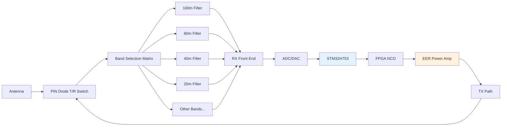
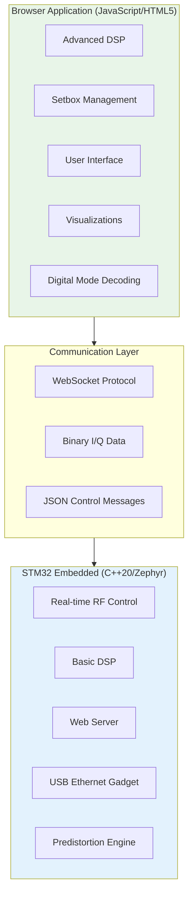
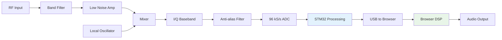

# NexRig: Technical Architecture
## Hardware, Software, and RF Design

### Hardware Architecture

The NexRig hardware platform centers around an STM32H753
microcontroller - a 480MHz Cortex-M7 processor with 1MB of both flash
memory and RAM. This isn't overkill; real-time RF control, web
serving, and DSP processing demand serious computational resources.

The RF section covers all ten HF amateur bands from 160 meters down to
10 meters, using PIN diode switching for band selection and
transmit/receive switching. Each band gets its own order-5 Chebyshev
bandpass filter rated for the full 50-watt output power. The result
is excellent harmonic suppression and band isolation without the
complexity of mechanical switching.

Power management deserves special attention. The system operates from
12V DC at up to 10 amperes, providing 120 watts total system power.
The transmit path uses envelope elimination and restoration (EER)
architecture, where a tracking buck/boost converter modulates the
power amplifier's supply voltage to create amplitude modulation, while
an FPGA-based numerically controlled oscillator (NCO) handles phase
modulation.

This EER approach achieves high efficiency even with complex
modulation schemes by eliminating the traditional linear amplifier's
constant high-voltage operation. Instead, the PA supply tracks the
envelope of the desired output signal, dramatically reducing power
consumption and heat generation.

### Software Architecture

The software stack divides responsibilities between the embedded
system and the browser application, with each handling what it does
best.

**Embedded System Responsibilities**: The STM32 handles everything
that requires hard real-time performance or direct hardware control.
This includes RF switching sequences, power amplifier protection,
anti-aliasing filtering, and the predistortion system that maintains
transmit signal quality. The embedded system also serves as a USB
ethernet gadget with an integrated captive portal, eliminating driver
installation requirements.

**Browser Application Responsibilities**: The browser handles
computationally intensive DSP operations, user interface management,
and all the setbox inheritance logic. Modern browsers provide
excellent performance for these tasks, and the development environment
is far more accessible than embedded programming for most
contributors.

The communication between these systems uses WebSocket protocols with
binary framing for I/Q data streams and JSON messaging for control and
status information. I/Q samples flow at 96 kS/s with 24-bit
resolution, while audio input to the transmitter uses 48 kS/s 8-bit
amplitude and phase samples. The total bandwidth requirement of
approximately 5.4 Mbps fits comfortably within USB 2.0 capacity.

### RF Signal Processing

The receive path implements a direct-conversion architecture with I/Q
sampling at baseband. Anti-aliasing filters in the STM32 handle
initial signal conditioning, while the browser application performs
demodulation, additional filtering, and audio processing.

The transmit path reverses this process but adds the complexity of the
EER power amplifier system. Audio processing in the browser generates
amplitude and phase samples that the STM32 converts to envelope
tracking commands for the buck/boost converter and phase control
commands for the FPGA NCO.

A critical feature is the adaptive predistortion system. The
transmitter includes a feedback path that samples the actual RF
output, attenuates it, and feeds it back to the receive chain. By
comparing the intended signal with the actual output, the system can
automatically compensate for power amplifier nonlinearities and
maintain excellent signal quality across all power levels and
modulation types.

# Transmit/Receive Switching
When the transceiver is in receive mode, the antenna signal is coupled
to the input of the selected band's receive bandpass filter, which
then provides an input to the GALI-74+ LNA and thence to the Tayloe
detector.

When in transmit mode, the receiver path is used to acquire a sample
of the transmitted signal -- much attenuated -- so that Digital
Pre-Distortion (DPD) and other calibrations can be calculated. This
requires the receiver path to be disconnected from the antenna. The
GALI-74+ LNA's input is instead provided in this case from the
transmitter sampling attenuator (500k:50 ohm resistor divider). During
receive mode this divider is disconnected so it doesn't add noise to
the very small incoming antenna signal.

# Master Clock TCXO
The FPGA is driven by a 30MHz master temperature compensated clock
oscillator. This produces a "clipped sine wave" signal, but the FPGA
input pin receiving the clock is configured as a schmitt triggered
input pin, which cleans that lazy sine wave right up. From this
frequency all of the other clocks for the board are derived, and,
particularly, the transmit and receive VFO and the STM32 clock.

### Development Standards and Practices

The project maintains consistent coding standards across both embedded
and browser components. All code uses CamelCase naming conventions for
variables, functions, and methods, with SNAKE_CASE reserved only for
constants and preprocessor macros.

The embedded system targets C++20 running on Zephyr RTOS, taking
advantage of modern language features for safer and more expressive
code. The browser application uses modern JavaScript (ES2022+) with
React for component management and state handling.

**Performance Requirements**: The system maintains sub-100ms response
times for critical RF parameter changes, continuous I/Q streaming at
96 kS/s, and smooth real-time waterfall displays. These requirements
drive many of the architectural decisions, particularly the division
of responsibilities between embedded and browser components.

**Communication Protocol**: The WebSocket protocol uses binary frames
for high-throughput I/Q data and JSON messages for control and status
updates. This hybrid approach optimizes for both efficiency and
development simplicity.

### Hardware Interface Abstractions

The embedded software provides clean C++20 abstractions for all
hardware interfaces. PIN diode switching, power amplifier control, and
RF parameter adjustment all use object-oriented interfaces that hide
hardware complexity from higher-level code.

These abstractions enable rapid development and testing while
maintaining the real-time performance requirements of RF operation.
The modular design also simplifies hardware variations and upgrades
without requiring extensive software changes.

### Testing and Validation Strategy

Real-time RF systems present unique testing challenges that require
both automated testing and careful measurement validation. The project
includes provisions for automated testing of DSP algorithms,
communication protocols, and user interface components.

Hardware validation requires RF test equipment for measuring transmit
signal quality, receive sensitivity, and harmonic suppression. The
integrated predistortion system provides some self-monitoring
capability, but external measurement remains essential for complete
validation.

The open-source nature of the project enables distributed testing
across different operating environments and use cases, helping
identify issues that might not appear in controlled laboratory
conditions.
