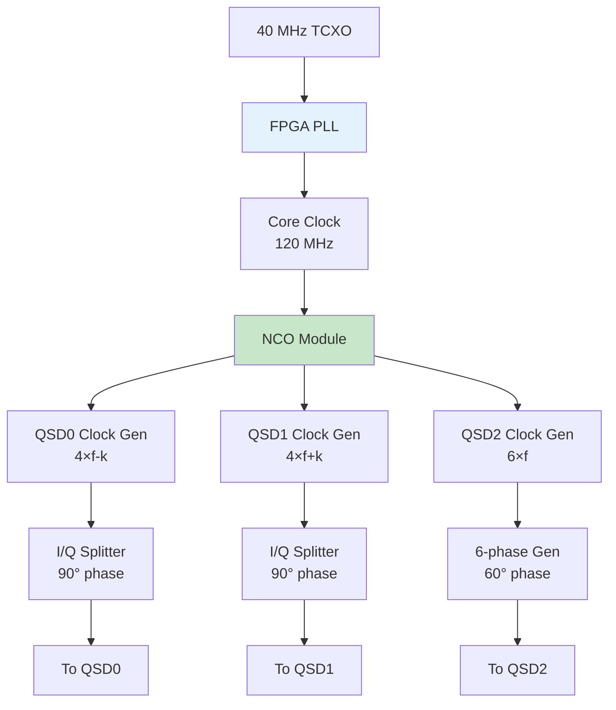
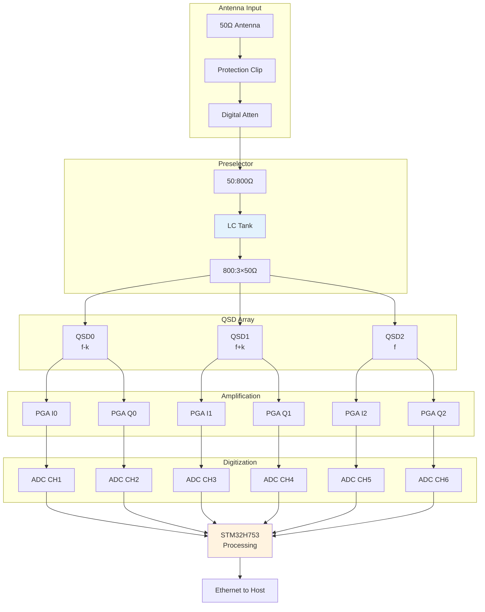

# NexRig: Receiver Architecture
## Triple-QSD Direct Conversion with Harmonic Rejection

**Document Version:** 1.0  
**Date:** October 2025  
**Supersedes:** Previous RX-ARCHITECTURE.md versions

---

## Table of Contents

1. [Introduction](#introduction)
2. [Architecture Overview](#architecture-overview)
3. [Front-End Protection and Attenuation](#front-end-protection-and-attenuation)
4. [800Ω Preselector Design](#800ω-preselector-design)
5. [Impedance Transformation](#impedance-transformation)
6. [Triple-QSD Architecture](#triple-qsd-architecture)
7. [Programmable Gain Amplifiers](#programmable-gain-amplifiers)
8. [Anti-Aliasing and ADC Interface](#anti-aliasing-and-adc-interface)
9. [FPGA Clock Generation](#fpga-clock-generation)
10. [AGC Strategy](#agc-strategy)
11. [Signal Processing Flow](#signal-processing-flow)
12. [Performance Analysis](#performance-analysis)

---

## Introduction

The NexRig receiver represents a departure from traditional amateur
radio receiver architectures. Instead of superheterodyne conversion
with its inherent image frequency problems, or simple direct
conversion with its harmonic response issues, NexRig implements a
**triple-QSD architecture** that provides digital performance through
high dynamic range digital signal processing path rather than relying
so much--as is traditional for receviers--on analog electronics for
selectivity.

### Design Philosophy

The receiver design prioritizes several key principles:

**Harmonic Rejection Without Filtering**: By using three QSDs at
different sampling phases and frequencies, the system achieves >40 dB
harmonic rejection through mathematical cancellation rather than
analog filtering.

**Impedance Domain Optimization**: The preselector operates at 800Ω
nominal impedance rather than the traditional 50Ω, providing superior
selectivity and reduced component stress while maintaining excellent
dynamic range.

**Software-Defined Flexibility**: Maximum functionality is implemented
in software (STM32 firmware and host application), allowing
improvements and new features without hardware changes.

**Protection Through Multiple Layers**: The receiver employs cascaded
protection mechanisms—from antenna-level clipping to software gain
control—ensuring robust operation even with strong nearby
transmitters.

---

## Architecture Overview

### Signal Path Summary

```mermaid
graph LR
    A[Antenna<br/>50Ω] --> block[DC Block &<br/>Protection]
	block --> T50200[Impedance<br/>Transform<br/>50→200Ω]
	T50200 --> tuner[Digital<br/>Antenna<br/>Tuner]
    tuner --> bruene[Bruene<br/>Impedance<br/>Sampler]
	bruene -> LPFs[Tx Low<br/>Pass<br/>Filters]
    LPFs --> TRrelay[T/R Relay]
	TRrelay --> TVS25[25V pk-pk<br/>Limiter]
	TVS25 --> C[Digital<br/>Attenuator<br/>0-45dB]
    C --> D[Impedance<br/>Transform<br/>200→800Ω]
    D --> E[Preselector<br/>800Ω LC Tank]
    E --> F[Transform<br/>800→3×50Ω]
	F --> TVS13[13V pk-pk<br/>Limiter]
	TVS13 --> G[Triple QSD<br/>Array]
    G --> H[6× MAX9939<br/>PGAs]
    H --> I[Anti-Alias<br/>Filters]
    I --> J[AK5578<br/>ADC (6ch)]
    J --> K[STM32H753<br/>Processing]
    K --> L[Ethernet to<br/>Host PC]
    
    style E fill:#e3f2fd
    style G fill:#c8e6c9
    style K fill:#fff3e0
```

The receiver processes signals through distinct functional blocks,
each optimized for its specific role:

1. **Protection and Attenuation**: Handles strong signals and provides coarse gain control
2. **Preselector**: Provides band-specific selectivity at 800Ω impedance
3. **Triple-QSD Demodulation**: Converts RF to baseband with harmonic rejection
4. **Programmable Gain**: Fine gain control with differential signal processing PGAs
5. **Digitization**: High-resolution conversion with anti-aliasing
6. **Digital Processing**: Signal combining and initial DSP in STM32
7. **Host Processing**: Advanced DSP and demodulation in PC application

---

## Front-End Protection and Attenuation

### Input Protection

The receiver input must survive various fault conditions while
maintaining sensitivity for weak signals:

**DC Blocking**: A series 1μF/100V C0G capacitor prevents DC from the
antenna connection from damaging downstream components. This also
blocks any DC bias that might be present for powering external preamps
or active antennas (though NexRig doesn't provide such bias).

**Primary Protection Clipping**: Fast Protection Circuit
```
Antenna → DC Block
        → 25V Protection Diodes
		→ Attenuator
		→ 13V Protection Diodes
		→ Preselector and QSDs
```

The protection diodes are TVS devices, clipping the input to 25V pk-pk
prevent damage to attenuator pad switching devices. At 50Ω this
represents a nearly +40dBm signal. Such powerful signals can come from
nearby transmitters and lighting and other electric pulse noise
sources. Protecting the attenuator pad devices allows these to be used
to reduce the signal level by up to 45dB to the remainder of the
receiver, keeping the components safe.

The preselector switching and the QSD switches following after are
further protected from damage by another 13V pk-pk TVS limiter to
handle cases where the attenuator isn't set quickly enough for safe
voltage levels during transients.

### Digital Attenuator

The digital attenuator provides 0-45 dB attenuation in 3 dB steps
using digitally switched resistive pads:

**Topology**: Cascaded T-pad digitally enabled sections
- 24 dB pad
- 12 dB pad
- 6 dB pad
- 3 dB pad

**Implementation**: Each pad uses a **AS169-73LF pHEMT SPDT switch
chip** wired for true bypass. When this switch is "off" , the signal
routes completely around the pad with minimal insertion loss. When
"on", the signal passes through the resistive pad network.

**Control**: The STM32 controls these attenuator stages. This provides
any attenuation combination from 0 to 45 dB in 3 dB steps.

---

## 800Ω Preselector Design

### Why 800Ω?

Traditional 50Ω preselectors suffer from several limitations:

| Parameter | 50Ω System | 800Ω System | Improvement |
|-----------|------------|-------------|-------------|
| Q Factor | R/X_L = 50/X_L | R/X_L = 800/X_L | 16× higher |
| Voltage for 1W | 7.1V | 28.3V | 4× higher |
| Current for 1W | 141mA | 35mA | 4× lower |
| Component stress | High current | Low current | Reduced |
| Selectivity | Limited Q | Excellent Q | Superior |

The 800Ω impedance represents a balance between achievable Q,
component stress, and practical implementation.

### LC Tank Circuit

The preselector uses switched inductors and a binary-weighted capacitor bank:

**Inductors** (Selected via AS169-73LF pHEMT switches):
- L1: 500nH with 2.2nF parallel resonance trap and 6.8Ω series damping (160m/80m)
- L2: 480nH (mid-HF bands)
- L3: 180nH (upper-HF bands)
- L4: 68nH (10m band)

These can be used individually or in parallel combinations to achieve
continuous coverage from 1-30 MHz.

**Capacitor Bank**:
- 10-bit binary-weighted: 4, 8, 16, 32, 64, 128, 256, 512, 1024, 2048 pF
- Total range: 4-4092 pF in 4 pF steps
- Additional fixed 10nF for 160m operation
- ~18pF parasitic (PCB and switch capacitance)

### Q Management Strategy

The preselector Q varies with frequency and configuration:

```
At 1.9 MHz (160m): Q = 91 (reduced by 6.8Ω series resistor)
   Bandwidth = 1.9 MHz / 91 = 21 kHz

At 7 MHz (40m): Q = 533 (natural inductor Q)
   Bandwidth = 7 MHz / 533 = 13 kHz

At 28 MHz (10m): Q = 667 (approaching inductor limit)
   Bandwidth = 28 MHz / 667 = 42 kHz
```

### Frequency Coverage

| Band | Frequency Range | L Config | Effective L | C Range | Tuning Step |
|------|-----------------|----------|-------------|---------|-------------|
| 160m | 1.8-2.0 MHz | L1+2.2nF | 500nH damped | 12-14 nF | 0.5 kHz/4pF |
| 80m | 3.5-4.0 MHz | L1+2.2nF | 500nH damped | 3.6-4.5 nF | 2.0 kHz/4pF |
| 40m | 7.0-7.3 MHz | L3 | 180nH | 2.85-2.90 nF | 10 kHz/4pF |
| 20m | 14.0-14.35 MHz | L2\|\|L3 | 131nH | 985-990 pF | 40 kHz/4pF |
| 10m | 28.0-29.7 MHz | L4 | 68nH | 475-480 pF | 70 kHz/4pF |

Parallel inductor combinations fill coverage gaps, ensuring continuous
1-30 MHz general coverage capability.

---

## Impedance Transformation

### Input Transformer (200Ω to 800Ω)

The input transformer provides impedance transformation while maintaining signal integrity:

**Specifications**:
- Core: FT50-43 ferrite toroid (or FT50-63 for lower frequencies)
- Autotransformer: 8t #26 AWG bifilar with (50Ω) on center and (800Ω) on hot end.
- Voltage gain: +6 dB
- Bandwidth: >30 MHz

The 1:2 turns ratio provides the 1:4 impedance transformation,
stepping up from 200Ω to 800Ω. The ferrite material ensures low loss
and wide bandwidth.

### Output Transformer (800Ω to 3×50Ω)

This critical transformer must provide three identical outputs for the triple-QSD array:

**Specifications**:
- Core: FT50-43 binocular or toroid
- Primary: 16 turns, #26 AWG (800Ω)
- Secondaries: Three separate 4-turn #26 AWG trifilar wound for matched coupling
- Impedance: 800Ω to 50Ω per output (nominal)
- Actual output impedance: 2-4Ω at HF (dominated by leakage inductance)

**Why Trifilar Winding?**: The three secondary windings must be
absolutely identical in impedance and coupling to maintain I/Q balance
across the three QSDs. Trifilar winding—where all three wires are
wound together—ensures this matching.

**Low Output Impedance Requirement**: The QSDs present switched
capacitive loads (1000pF sampling capacitors). At 30 MHz with 6×
oversampling, each capacitor must charge in ~1.4ns. The transformer's
low output impedance (2-4Ω from winding resistance and leakage
inductance) enables adequate charging even at high frequencies.

---

## Triple-QSD Architecture

### The Innovation

Traditional direct conversion receivers suffer from harmonic
responses—they respond not only to the desired frequency but also to
odd harmonics (3f, 5f, 7f, etc.). NexRig's triple-QSD architecture
provides >40 dB harmonic rejection through complementary signal
processing.

### Three QSD Channels

**QSD0**: Operates at f-k (typically f-12 kHz)
- Standard quadrature sampling (4× clock)
- 25% duty cycle provides some harmonic rejection
- Primary signal path for lower sideband

**QSD1**: Operates at f+k (typically f+12 kHz)
- Standard quadrature sampling (4× clock)
- 25% duty cycle
- Combines with QSD0 for image rejection

**QSD2**: Operates directly at f
- Special 6× clock (33.33% duty cycle)
- Provides >40 dB third harmonic rejection
- Reference for carrier-related measurements

### QSD Implementation

Each QSD uses a **Texas Instruments TS3A4751** analog switch:

**Key Specifications**:
- Single-pole, four-throw (SP4T) configuration
- 0.9Ω on-resistance
- 3.3V operation (strict 0-3.3V signal requirement)
- -3dB bandwidth: >300 MHz
- Charge injection: <2 pC

**Sampling Capacitors**: Each QSD output (I+, I-, Q+, Q-) connects to
a 2.2uF C0G capacitor. These capacitors integrate the switched RF
signal, providing the baseband I/Q outputs.

### Signal Biasing

The QSD inputs must remain within 0-3.3V. This is achieved through AC
coupling and DC biasing:

```
Transformer Secondary → 1μF AC coupling → +1.65V bias injection → QSD input

Bias injection circuit:
- 2.2μH RFC from +1.65V reference
- 1μF bypass capacitor on bias rail
- Provides high-impedance DC bias without loading RF
```

With the transformer providing ±0.7V AC signals and 1.65V DC bias, the
QSD input ranges from 0.95V to 2.35V—safely within the 0-3.3V
requirement.

### Mathematical Harmonic Cancellation

The three QSD outputs combine in software to reject harmonics:

```
For desired signal at frequency f:
- QSD0 response: A₀ × cos(2π(f-k)t + φ₀)
- QSD1 response: A₁ × cos(2π(f+k)t + φ₁)
- QSD2 response: A₂ × cos(2πft + φ₂)

For third harmonic at 3f:
- QSD0: Responds but shifted by 3k
- QSD1: Responds but shifted by -3k
- QSD2: Suppressed by 33.33% duty cycle

Combined output: Desired signal preserved, harmonics cancelled
```

The exact combining weights are determined during calibration and
adapt based on signal conditions.

---

## Programmable Gain Amplifiers

### MAX9939 Architecture

Following each QSD, a MAX9939 programmable gain amplifier provides
fine gain control:

**Configuration**:
- Six MAX9939 devices total (one per I/Q channel)
- Differential input/output configuration
- Internal biasing to 2.5V common mode
- Gain range: -14 dB to +44 dB (58 dB total range)
- SPI control from STM32
- Single +5V supply

### Gain Distribution Strategy

The total receiver gain is distributed across multiple stages:

| Stage | Gain Range | Purpose | Control Speed |
|-------|------------|---------|--------------|
| Digital Attenuator | 0 to -45 dB | Coarse adjustment | Slow (100ms) |
| Preselector Q | 0 to +27 dB | Frequency-dependent | N/A |
| MAX9939 PGAs | -14 to +44 dB | Fine adjustment | Fast (10μs) |
| Digital (STM32) | 0 to +∞ dB | Final scaling | Instant |

**Total Range**: -45 dB to +71 dB analog, plus unlimited digital gain

### Differential Signal Processing

The MAX9939 operates with differential signals throughout:

```
QSD Output (single-ended) → AC coupling → MAX9939 (differential) → ADC (differential)

Benefits of differential operation:
- Common-mode noise rejection
- No ground loops
- Doubled signal swing
- Better ADC utilization
```

The MAX9939 converts single-ended QSD outputs to differential signals
internally, maintaining signal integrity through the analog chain.

### Independent Channel Gain

The six PGAs can be set to different gains, enabling several optimizations:

**QSD2 Compensation**: QSD2 (6× sampling) has different gain than
QSD0/1 (4× sampling). Independent PGA settings compensate for this
difference.

**Dynamic Range Optimization**: During strong signal conditions,
reduce gain on the primary signal channel while maintaining higher
gain on the auxiliary channels for weak signal detection.

**Calibration**: Each channel's gain can be trimmed independently to
compensate for component tolerances.

---

## Anti-Aliasing and ADC Interface

### Anti-Aliasing Filters

Before digitization, anti-aliasing filters prevent high-frequency
components from creating aliases:

**Topology**: Differential RC low-pass filters
```
MAX9939 OUTA → 1kΩ → ADC IN+
                  ↓
                4.7nF (to ground)
                  ↓
MAX9939 OUTB → 1kΩ → ADC IN-

Cutoff frequency: fc = 1/(2π×1kΩ×4.7nF) = 34 kHz
```

The 34 kHz cutoff provides adequate attenuation at the Nyquist
frequency (48 kHz) while preserving the entire HF spectrum after
down-conversion to baseband.

### Protection Diodes

Despite earlier protection stages, fast transients could still damage
the ADC. Final protection uses Schottky diode arrays:

```
Each ADC input pin:
- BAV99 dual diode array (or similar)
- Clamps to GND and +5V (AVDD)
- Sub-nanosecond response time
- Minimal capacitance (<2pF)
```

### AK5578 Audio Codec

The AK5578 provides high-quality analog-to-digital conversion:

**Key Specifications**:
- 8 channels (6 used for three I/Q pairs)
- 24-bit resolution
- 96 kHz sampling rate
- 103 dB dynamic range
- Differential inputs
- +5V single supply
- I²S interface to STM32

**Channel Allocation**:
| ADC Channel | Signal | QSD Source |
|-------------|--------|------------|
| CH1 | I (f-k) | QSD0 I output |
| CH2 | Q (f-k) | QSD0 Q output |
| CH3 | I (f+k) | QSD1 I output |
| CH4 | Q (f+k) | QSD1 Q output |
| CH5 | I (f) | QSD2 I output |
| CH6 | Q (f) | QSD2 Q output |
| CH7 | Unused | - |
| CH8 | Unused | - |

The 96 kHz sampling rate provides 48 kHz of real-time bandwidth,
sufficient for observing an entire amateur band simultaneously.

---

## FPGA Clock Generation

### Lattice iCE40UP3K FPGA

The FPGA generates all QSD clocking signals with precise phase
relationships:

**FPGA Specifications**:
- Device: Lattice iCE40UP3K
- Logic cells: 2,800
- Block RAM: 1,152 Kbits
- Clock source: 40 MHz TCXO (external)
- Power: 3.3V and 1.2V supplies

### Clock Generation Architecture



### NCO Implementation

Each QSD requires its own numerically controlled oscillator:

**NCO Architecture**:
```verilog
// Conceptual representation (not actual code per your preferences)
32-bit phase accumulator
32-bit frequency control word
16-bit phase modulation input (for TX)
4 or 6 phase comparators for output generation
```

**Frequency Resolution**: 
- With 120 MHz clock and 32-bit accumulator
- Resolution = 120 MHz / 2³² = 0.028 Hz
- More than sufficient for amateur radio tuning

### Phase Generation

**QSD0 and QSD1 (Quadrature - 4× clock)**:
- Generate 4 phases: 0°, 90°, 180°, 270°
- Each phase drives switch for 25% duty cycle
- Creates I and Q channels with 90° relationship

**QSD2 (Sextature - 6× clock)**:
- Generate 6 phases: 0°, 60°, 120°, 180°, 240°, 300°
- Each phase drives switch for 16.67% duty cycle  
- 33.33% total duty cycle (two switches active)
- Provides 3rd harmonic rejection

### Clock Distribution

The FPGA outputs drive the QSD switches directly:

```
FPGA output characteristics:
- 3.3V LVCMOS levels
- Drive strength: 8mA
- Rise/fall time: <2ns
- Trace length matching: ±5mm

PCB requirements:
- Controlled impedance: 50Ω
- Differential pairs for each I/Q set
- Minimize clock skew (<100ps between I/Q)
```

---

## AGC Strategy

### Multi-Layer AGC Architecture

The AGC system prevents overload while maintaining optimal
signal-to-noise ratio:

**Level Detection Points**:
1. ADC output level (primary)
2. PGA output clipping detection
3. QSD output saturation detection
4. Preselector voltage limiting

### AGC Control Loops

**Fast Loop (10μs response)**:
- Controls MAX9939 PGA gain
- Prevents ADC overload
- Maintains signal within optimal ADC range
- Independent control per QSD channel

**Slow Loop (100ms response)**:
- Controls digital attenuator switching
- Reduces front-end gain for strong signals
- Hysteresis prevents oscillation

**Software Loop (1ms response)**:
- Digital gain scaling in STM32
- Final output level adjustment
- Provides smooth audio output
- Coordinates with host application

### AGC Algorithm

```
Every 100μs:
1. Read ADC peak levels for all channels
2. If any channel >90% of full scale:
   - Reduce PGA gain by 6dB immediately
   - Set flag for slow loop evaluation
3. If all channels <30% of full scale:
   - Increase PGA gain by 3dB
   - Clear slow loop flag

Every 100ms:
1. If fast loop consistently reducing gain:
   - Insert next attenuator step (3dB)
   - Increase PGA gain by 3dB (compensate)
2. If fast loop consistently increasing gain:
   - Remove attenuator step if possible
   - Decrease PGA gain to compensate
```

### User-Selectable AGC Modes

The host application provides several AGC personalities:

| Mode | Attack | Release | Hang Time | Use Case |
|------|--------|---------|-----------|----------|
| Fast | 1ms | 100ms | 100ms | CW, digital modes |
| Medium | 10ms | 500ms | 500ms | SSB voice |
| Slow | 100ms | 2s | 1s | AM broadcast |
| Manual | - | - | - | User-controlled gain |

These settings control the software AGC loop. Hardware loops always
operate at fixed speeds for protection.

---

## Signal Processing Flow

### Hardware Signal Path



### Digital Signal Processing (STM32)

The STM32H753 performs initial signal processing:

**Sample Rate Alignment**:
- Receives 96 kHz I²S data from AK5578
- Maintains sample synchronization across 6 channels
- Buffers for Ethernet transmission

**Channel Combining**:
```
Simple combining (performed in STM32):
- Output_I = w₀×I₀ + w₁×I₁ + w₂×I₂
- Output_Q = w₀×Q₀ + w₁×Q₁ + w₂×Q₂

Where weights w₀, w₁, w₂ are calibrated values
```

**Data Formatting**:
- Pack 24-bit samples for Ethernet transmission
- Add timestamps and metadata
- Implement flow control

### Digital Signal Processing (Host PC)

The host application performs advanced DSP:

**Advanced Combining**:
- Adaptive weight calculation based on signal conditions
- Harmonic cancellation optimization
- Noise correlation analysis

**Demodulation**:
- SSB (LSB/USB) with carrier reconstruction
- CW with audio filters and AGC
- AM with carrier tracking
- FM with discriminator
- Digital modes (PSK31, FT8, RTTY, etc.)

**Filtering and Enhancement**:
- Variable bandwidth filters
- Notch filters for interference
- Noise reduction algorithms
- Audio processing (EQ, compression)

---

## Performance Analysis

### Sensitivity

The receiver sensitivity is determined by thermal noise and system
noise figure:

```
Thermal noise floor at 50Ω, 500Hz bandwidth:
N = kTB = 1.38×10⁻²³ × 290 × 500 = -141 dBm

System noise figure estimate:
- Input transformer: 1 dB
- Preselector loss: 2 dB  
- QSD conversion loss: 3 dB
- Total NF: ~6 dB

MDS (Minimum Detectable Signal) for 10dB SNR:
MDS = -141 dBm + 6 dB + 10 dB = -125 dBm
```

This sensitivity rivals commercial amateur transceivers.

### Dynamic Range

Dynamic range is limited by ADC capability and front-end handling:

**Instantaneous Dynamic Range**:
```
ADC: 24-bit = 144 dB theoretical
Practical: ~100 dB (limited by ADC noise floor)

With 45 dB attenuator range: 100 + 45 = 145 dB total
```

**Blocking Dynamic Range**:
```
Maximum input before compression: +17 dBm (protection limit)
MDS: -125 dBm
BDR = 17 - (-125) = 142 dB
```

**Two-Tone IMD Dynamic Range**:
```
IP3 estimate (QSD-limited): +20 dBm
IMD DR = 2/3 × (20 - (-125)) = 97 dB
```

### Image Rejection

The triple-QSD architecture provides exceptional image rejection:

**Traditional Direct Conversion**: No image rejection (image equals
desired frequency)

**Image-Reject Mixer**: 30-40 dB typical image rejection

**NexRig Triple-QSD**: 
- Mathematical combining: >40 dB
- Preselector addition: >20 dB
- Total: >60 dB image rejection

### Harmonic Response

Harmonic rejection without preselector:

| Harmonic | QSD0/1 Response | QSD2 Response | Combined |
|----------|-----------------|---------------|-----------|
| 3rd (3f) | -9 dB | -45 dB | -42 dB |
| 5th (5f) | -14 dB | -25 dB | -28 dB |
| 7th (7f) | -17 dB | -20 dB | -22 dB |

With preselector tuned to fundamental, add 20-40 dB additional
harmonic rejection.

### Phase Noise

Phase noise is determined by the FPGA clock source:

```
40 MHz TCXO specifications:
- 10 Hz offset: -80 dBc/Hz
- 100 Hz offset: -110 dBc/Hz
- 1 kHz offset: -130 dBc/Hz
- 10 kHz offset: -140 dBc/Hz

After multiplication to HF:
Add 20×log₁₀(N) where N is multiplication factor

At 28 MHz (N=0.7): Actually improves by 3dB
At 14 MHz (N=0.35): Improves by 9dB
```

The direct conversion architecture avoids high multiplication factors,
maintaining excellent phase noise.

---

## Calibration and Optimization

### Factory Calibration

Initial calibration establishes baseline performance:

**I/Q Balance Calibration**:
1. Inject test signal at QSD frequency
2. Measure I and Q amplitudes
3. Adjust PGA gains for equal amplitude
4. Measure phase relationship
5. Store correction factors

**Harmonic Cancellation Weights**:
1. Inject signals at f, 3f, 5f
2. Measure response on each QSD
3. Calculate optimal combining weights
4. Store in calibration table

**Frequency Response**:
1. Sweep 1-30 MHz at multiple amplitude levels
2. Measure response variation
3. Create correction table
4. Apply in software

### User Calibration

Periodic calibration maintains optimal performance:

**Attenuator Calibration**:
- Verify each step provides correct attenuation
- Adjust PGA gains to compensate for tolerance

**Temperature Compensation**:
- Monitor STM32 internal temperature
- Apply correction factors to VCO frequency
- Adjust PGA gains for temperature drift

### Self-Test Capabilities

Built-in test signal generation enables self-calibration:

**Test Signal Sources**:
- STM32 DAC: Generate two-tone test signals
- FPGA: Generate phase-shifted test signals
- External: Loop-back from TX output

**Automated Tests**:
- Sensitivity verification
- Dynamic range measurement
- Image rejection verification
- Harmonic response check

---

## Design Trade-offs and Rationale

### Why Triple-QSD?

**Alternative Considered**: Traditional superheterodyne
- Pros: Excellent image rejection, proven technology
- Cons: Complex filters, multiple conversion stages, higher cost

**Alternative Considered**: Simple direct conversion
- Pros: Simple, low cost
- Cons: No image rejection, harmonic responses, DC offset issues

**Triple-QSD Advantages**:
- Combines best of both architectures
- Software-defined flexibility
- No expensive crystal filters
- Exceptional harmonic rejection

### Why 800Ω Preselector?

**Alternative Considered**: Traditional 50Ω
- Pros: Standard impedance throughout
- Cons: Lower Q, higher current stress

**Alternative Considered**: Even higher impedance (>1kΩ)
- Pros: Even better Q
- Cons: Voltage stress exceeds component ratings

**800Ω Optimum**:
- 16× Q improvement over 50Ω
- Manageable voltage levels
- Available components
- Proven in high-performance receivers

### Why MAX9939 PGAs?

**Alternative Considered**: Discrete VGA circuits
- Pros: Customizable, potentially lower noise
- Cons: Complex, requires matching, drift issues

**Alternative Considered**: Digital step attenuators
- Pros: Precise steps, no drift
- Cons: Limited range, switching transients

**MAX9939 Advantages**:
- Wide gain range (-14 to +44 dB)
- SPI control simplifies interface
- Internal biasing reduces complexity
- Differential operation improves CMRR
- Single chip solution

---

## Integration with System

### Interface to Transmitter

During transmit operations, the receiver provides critical measurements:

**Antenna Impedance Measurement**:
- QSD0 measures forward power sample
- QSD1 measures reflected power sample  
- Calculate complex Γ and antenna impedance
- Enables deterministic antenna tuning

**Transmit Monitor**:
- Sample TX signal through attenuator
- Demodulate to verify signal quality
- Detect distortion or spurious emissions
- Provide feedback for digital predistortion

### Interface to STM32

The STM32H753 coordinates all receiver operations:

**SPI Bus** (3.3V, 10 MHz):
- MAX9939 gain control (6 devices)
- FPGA configuration and frequency control

**I²S Bus** (96 kHz, 24-bit):
- AK5578 ADC data interface
- Six channels of I/Q data

**GPIO Control**:
- Attenuator switch control (4 pins)
- Preselector switch control (8-12 pins)
- LED indicators and debugging

**Analog Interfaces**:
- Temperature monitoring (internal ADC)
- Power supply monitoring
- AGC threshold detection

### Interface to Host

The Ethernet connection carries all signal and control data:

**Real-time Streams**:
- 96 kHz I/Q samples (6 channels)
- ~15 Mbps total bandwidth
- UDP for low latency

**Control Messages**:
- Frequency changes
- Gain adjustments  
- Filter selection
- Calibration commands
- TCP for reliability

---

## Future Enhancements

### Potential Improvements

**Diversity Reception**: Add second identical receiver for diversity
combining, noise cancellation, or adaptive beamforming.

**VHF/UHF Coverage**: Add converter modules for 2m/70cm capability
using same digital backend.

**Improved Preselection**: Add more inductor values and
higher-resolution capacitor bank for narrower bandwidth on all bands.

**External Reference Input**: Add provision for 10 MHz external
reference for coherent receiver arrays or GPS disciplining.

### Software Enhancements

**Advanced DSP Modes**: Implement in host software without hardware changes:
- Adaptive notch filters
- Coherent CW for extreme weak signal work
- AI-based noise reduction
- Automatic signal classification

**Multi-Channel Reception**: Process multiple independent signals from single antenna:
- Monitor calling frequency while in QSO
- Simultaneous multiband WSPR/FT8 monitoring
- Real-time band activity scanning

---

## Conclusion

The NexRig receiver architecture represents a significant advancement
in amateur radio receiver design. The triple-QSD approach provides
exceptional harmonic rejection without complex filtering, while the
800Ω preselector delivers superior selectivity with reduced component
stress.

Key innovations include:

1. **Triple-QSD sampling** eliminates traditional direct conversion limitations
2. **800Ω preselector impedance** optimizes Q factor and component stress
3. **Comprehensive protection** ensures survival in harsh RF environments
4. **Software-defined flexibility** enables continuous improvement
5. **Integration with transmitter** provides vector network analysis capability

The modular architecture, comprehensive documentation, and open-source
nature invite experimentation and improvement from the amateur radio
community. Whether used as-is or as a platform for further
development, the NexRig receiver provides commercial-grade performance
in an accessible, hackable package.

---

**Document Revision**: 1.0  
**Last Updated**: October 2025  
**Related Documents**:
- SYSTEM-OVERVIEW.md - System architecture and key innovations
- TX-ARCHITECTURE.md - Transmitter design details
- SYSTEM-INTEGRATION.md - Component interconnections and protocols
- CONSTRUCTION-TESTING.md - Assembly and validation procedures

---

*End of RX-ARCHITECTURE.md*
