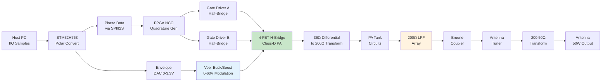
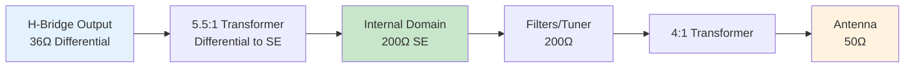
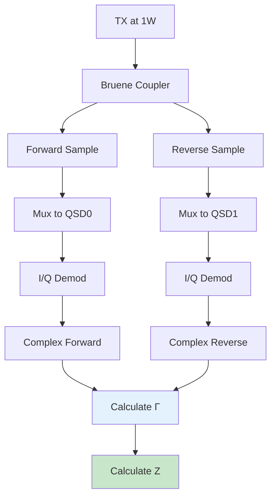
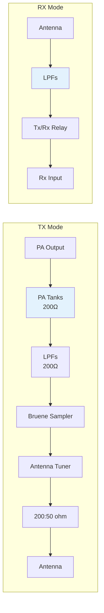

# NexRig: Transmitter Architecture
## Envelope Elimination and Restoration with Digital Control

**Document Version:** 2.0
**Date:** January 2025
**Supersedes:** TX-ARCHITECTURE.md v1.0

---

## Table of Contents

1. [Introduction](#introduction)
2. [Architecture Overview](#architecture-overview)
3. [Envelope Elimination and Restoration (EER)](#envelope-elimination-and-restoration-eer)
4. [Veer Buck/Boost Envelope Modulator](#veer-buckboost-envelope-modulator)
5. [FPGA NCO and Quadrature Phase Generation](#fpga-nco-and-quadrature-phase-generation)
6. [4-FET H-Bridge Power Amplifier](#4-fet-h-bridge-power-amplifier)
7. [Impedance Domain Architecture](#impedance-domain-architecture)
8. [Low-Pass Filter Array](#low-pass-filter-array)
9. [Antenna Impedance Measurement](#antenna-impedance-measurement)
10. [TX/RX Integration](#txrx-integration)
11. [Digital Pre-Distortion](#digital-pre-distortion)
12. [Performance Analysis](#performance-analysis)

---

## Introduction

The NexRig transmitter represents a fundamental rethinking of amateur radio
power amplifier design. Instead of traditional linear amplification
with its inherent inefficiency, NexRig implements **Envelope
Elimination and Restoration (EER)** - a technique that separates
amplitude and phase modulation to improve efficiency while maintaining
signal quality, moving these operations from the analog domain into
the digital domain.

The power amplifier uses a **4-FET quadrature-driven H-bridge** 
topology operating in Class-D switching mode. This architecture 
provides several critical advantages over traditional single-FET 
designs: natural cancellation of even-order harmonics, excellent 
linearity, DC isolation through transformer coupling, and distributed 
thermal stress across four smaller devices.

### Design Philosophy

The transmitter design embraces several revolutionary principles:

**Efficiency Through Switching**: Both the power amplifier and
envelope modulator operate as switching circuits, achieving >80%
efficiency compared to 25-50% for linear designs. The H-bridge 
topology enables high-speed switching at HF frequencies while 
maintaining excellent efficiency.

**Digital Control Throughout**: From envelope generation via DAC to
quadrature phase modulation via FPGA NCO, digital control replaces 
analog modulation circuits. The FPGA generates four precisely-timed 
gate drive signals (I+, I-, Q+, Q-) that control the H-bridge 
switching pattern.

**Impedance Domain Optimization**: The transmitter operates at 36Ω
differential impedance internally for optimal H-bridge performance, 
transforming to 200Ω single-ended for superior filter performance and 
reduced current stress, then finally to 50Ω only at the antenna 
interface.

**Zero-Voltage Switching**: All relay switching occurs with power
removed, extending relay life from 10⁵ to 10⁸+ operations.

**Even Harmonic Cancellation**: The differential, push-pull nature of 
the H-bridge naturally cancels all even-order harmonics (2nd, 4th, 
6th, etc.), dramatically reducing the burden on the LPF array. Only 
odd harmonics (3rd, 5th, 7th) require filtering.

**Vector Measurement Integration**: The transceiver performs full 
complex impedance measurement on the feed to the antenna, enabling
deterministic antenna tuning rather than trial-and-error, real power
output measurement, and simple VSWR display.

---

## Architecture Overview

### Signal Path Summary



The transmitter separates the signal into two paths:

1. **Amplitude Path**: Digital envelope → DAC → Veer modulator → H-bridge supply voltage
2. **Phase Path**: Digital phase → FPGA NCO → Quadrature generator → Four gate drivers → H-bridge MOSFETs

These paths recombine at the power amplifier to reconstruct the
transmitted signal with high efficiency.

---

## Envelope Elimination and Restoration (EER)

### Theoretical Foundation

EER, also known as the Kahn technique, decomposes any modulated signal
into amplitude and phase components:

```
RF_out(t) = A(t) × cos(ωt + φ(t))

Where:
- A(t) = instantaneous amplitude/envelope
- φ(t) = instantaneous phase
- ω = carrier frequency (2πf)
```

Traditional linear amplifiers maintain constant supply voltage while
varying current to create amplitude variations. This wastes power as
heat during low-amplitude portions of the signal.

EER instead:
1. Varies the PA supply voltage to track the envelope
2. Operates the PA as a switch (on/off only)
3. Achieves theoretical efficiency approaching 100%

### Implementation Architecture

**Signal Decomposition (Host PC)**:
```javascript
// Conceptual process (not actual code)
I/Q samples → magnitude = √(I² + Q²)
           → phase = atan2(Q, I)
```

**Envelope Path Characteristics**:
- Update rate: 48 kHz (48,000 samples/second)
- Resolution: 12-bit DAC (4096 levels)
- Bandwidth: DC to 5 kHz (sufficient for SSB)
- Dynamic range: 0-60V output (>35 dB)

**Phase Path Characteristics**:
- Update rate: 48 kHz phase modulation
- Carrier frequency: 1.8-30 MHz
- Phase resolution: 16-bit (0.0055° steps)
- Output: Four quadrature square waves (no amplitude information)

### Synchronization Requirements

Critical to EER operation is precise time alignment between envelope
and phase paths:

```
Envelope path delay: ~50µs (Veer response time)
Phase path delay: <1µs (nearly instantaneous)

Solution: Digital delay line in FPGA
- Delays phase updates by 50µs
- Maintains perfect envelope/phase alignment
- Adjustable in 20ns increments
```

---

## Veer Buck/Boost Envelope Modulator

### Design Requirements

The envelope modulator must track audio-frequency amplitude variations
while providing the full 0-60V range needed for 50W output:

| Parameter | Requirement | Implementation |
|-----------|------------|----------------|
| Input voltage | 20V (USB-PD) | Direct from USB-PD rail |
| Output voltage | 0-60V | Buck (0-20V) / Boost (20-60V) |
| Output current | 1.5A peak | 50W into 36Ω differential load |
| Bandwidth | 5 kHz | Sufficient for SSB voice |
| Efficiency | >85% | Switching topology |
| Ripple | <100mV | Filtered by PA tank |

### Circuit Implementation

**Power Stage Components**:
- Controller: LM34936 automotive buck/boost regulator
- MOSFETs: 4× CSD19532Q5B (100V, 4mΩ) in H-bridge
- Inductor: 6.8µH, 11A saturation, low DCR
- Switching frequency: 500 kHz (15kΩ on RT pin)
- Output capacitor: 10µF/100V NP0 ceramic

**Control Loop**:
```
STM32 DAC (0-3.3V) → TLV9062 Error Amplifier → LM34936 FB Pin
                              ↑
                    Veer_out × (10k/190k) feedback

Closed-loop gain: 190k/10k = 19
Full scale: 3.3V × 19 = 62.7V (allows headroom)
```

**Current Limiting**:
- Sense resistor: 0.015Ω, 5W, Kelvin connection
- Filtering: 1kΩ + 10nF (16 kHz bandwidth)
- Limit threshold: 8A (133mV across sense resistor)
- Protection: Cycle-by-cycle current limiting

### Dynamic Performance

For typical SSB voice envelope:

```
Average speech power: 25% of PEP (12.5W average)
Average Veer voltage: √(12.5 × 36) = 21V
Peak Veer voltage: 60V (during voice peaks)
Crest factor: 10-15 dB typical

Efficiency improvement:
- Linear PA: 50W/120W = 42% efficiency
- EER PA: 50W/75W = 67% efficiency
- Power saved: 45W (37.5% reduction)
```

### PCB Layout Considerations

Critical for switching converter performance:

1. **Power Loop Minimization**: Keep buck/boost power MOSFETs,
   inductor, and output capacitor in tight loop
2. **Ground Plane**: Solid ground under entire converter
3. **Gate Drive**: Short traces from controller to MOSFET gates
4. **Thermal Relief**: Adequate copper for MOSFET heat dissipation
5. **Output Filtering**: Place output capacitor close to PA supply input

---

## FPGA NCO and Quadrature Phase Generation

### NCO Architecture

The FPGA implements a high-resolution numerically controlled
oscillator with quadrature output generation:

```
Components:
- 32-bit phase accumulator
- 32-bit frequency control word (FCW)
- 16-bit phase modulation input
- Quadrature phase splitter (0°, 90°, 180°, 270°)
- Four square wave output generators

Operation each clock cycle:
1. Phase_acc = Phase_acc + FCW + Phase_mod
2. Generate I+ = MSB of Phase_acc
3. Generate I- = NOT(I+)
4. Generate Q+ = MSB of (Phase_acc + 90°)
5. Generate Q- = NOT(Q+)
```

### Frequency Generation

**Frequency Resolution**:
```
FPGA clock: 120 MHz (from 40 MHz TCXO × 3 PLL)
Resolution: 120 MHz / 2³² = 0.028 Hz
Tuning range: 0 to 60 MHz (Nyquist limit)
Practical range: 1.8-30 MHz (HF bands)
```

**Frequency Control Word Calculation**:
```
FCW = (F_desired × 2³²) / F_clock
Example for 14.200 MHz:
FCW = (14.2 × 10⁶ × 2³²) / 120 × 10⁶ = 508,559,958
```

### Quadrature Phase Generation

The FPGA generates four precisely-timed gate drive signals for the 
H-bridge:

```
Quadrature Phases:
- I+ (0°):   Drives Q1 (high-side, I-leg positive)
- I- (180°): Drives Q2 (low-side, I-leg negative)
- Q+ (90°):  Drives Q3 (high-side, Q-leg positive)
- Q- (270°): Drives Q4 (low-side, Q-leg negative)

Timing Requirements:
- Phase accuracy: ±0.1° (critical for harmonic cancellation)
- Rise/fall time: <2ns (faster than 120 MHz clock period)
- Skew between channels: <100ps (matched routing on PCB)
- Dead time insertion: 20-50ns (prevent shoot-through)
```

### Phase Modulation Implementation

Phase modulation updates arrive via SPI from STM32:

```
SPI Protocol:
- 16-bit phase offset value
- 48 kHz update rate
- Latency: <20µs
- Format: Binary offset, 360° = 65536 counts

Phase resolution: 360°/65536 = 0.0055°
More than adequate for any amateur mode
```

The FPGA also supports an I2S interface as an alternative to SPI for 
control and monitoring of NCO parameters.

### Output Signal Generation

The NCO produces four square wave outputs with precise phase 
relationships:

```
Advantages of square wave drive:
1. Maximum gate drive voltage (0V or 3.3V)
2. Fast transitions (<2ns rise/fall)
3. No amplitude modulator needed
4. Simplified gate driver design
5. Complementary pairs (I+/I-, Q+/Q-) inherent

H-bridge switching pattern:
- I+ high, I- low, Q+ low, Q- high: +Veer output (quadrant I)
- I+ low, I- high, Q+ high, Q- low: -Veer output (quadrant III)
- I+ high, I- low, Q+ high, Q- low: 0V output (quadrant II/IV)

This creates a 3-level differential output:
+Veer, 0V, -Veer
```

Harmonic content is managed by:
- H-bridge differential operation (cancels even harmonics)
- PA tank circuit (Q=10-20)
- Output low-pass filters
- Antenna tuner components

### Clock Distribution

```
40 MHz TCXO → FPGA PLL → 120 MHz system clock
                        → NCO module
                        → Quadrature generator
                        → SPI interface
                        → Delay compensation
                        → Synchronization logic
```

---

## 4-FET H-Bridge Power Amplifier

### Design Principles

The H-bridge topology operates in Class-D switching mode, achieving 
high efficiency through complementary switching:

```
Ideal Class-D H-Bridge Operation:
1. Switches operate in complementary pairs (I+/I-, Q+/Q-)
2. Dead time prevents shoot-through
3. No simultaneous conduction across supply
4. Differential output cancels even harmonics
5. Efficiency approaches 90% (practically 85-88%)
```

### Topology Overview

```
                     Veer (0-60V)
                          │
                ┌─────────┴─────────┐
                │                   │
             ┌──┴──┐             ┌──┴──┐
        I+   │ Q1  │        Q+   │ Q3  │
      ──────►│     │      ──────►│     │
             └──┬──┘             └──┬──┘
                │                   │
        I_out ──┼─────────┬─────────┼── Q_out
                │         │         │
             ┌──┴──┐   ┌──┴──┐   ┌──┴──┐
        I-   │ Q2  │   │ TX  │   │ Q4  │ Q-
      ──────►│     │   │Xfmr │   │     │◄──────
             └──┬──┘   └──┬──┘   └──┬──┘
                │         │         │
                └─────────┴─────────┘
                          │
                         GND

Where:
- Q1, Q2: I-leg (in-phase drive)
- Q3, Q4: Q-leg (quadrature drive)
- I_out, Q_out: Differential outputs to transformer
```

### MOSFET Selection

**Device Requirements** (all four MOSFETs must be identical):

| Parameter | Requirement | Rationale |
|-----------|-------------|-----------|
| Type | N-Channel | Simplifies gate drive |
| V_DS | >80V minimum, 100V preferred | Margin over 60V supply |
| Q_g (Total Gate Charge) | <10nC | **Primary metric** - minimizes gate drive power and switching time at 30 MHz |
| C_oss (Output Capacitance) | <150pF | **Secondary metric** - reduces switching losses (P = ½CV²f) |
| R_ds(on) | <100mΩ | Conduction losses (less critical than switching) |
| Package | DFN, PowerPAK, or similar | Low inductance, thermal pad for heat sinking |

**Candidate MOSFETs**:

**Primary Choice: EPC2012C (GaN FET)**
- V_DS: 200V (excellent margin)
- Q_g: 1.4nC (exceptional - 7× better than silicon)
- C_oss: 65pF @ 60V (excellent)
- R_ds(on): 16mΩ (adequate for distributed load)
- Package: Chip-scale (2.5mm × 1.5mm)
- Cost: ~$3-4 each (higher but justified by performance)

**Fallback Choice: BSZ0909ND (Dual N-Channel Silicon)**
- V_DS: 30V (requires 20V Veer max, or two in series)
- Q_g: 8nC each (good for silicon)
- C_oss: 140pF @ 20V (acceptable)
- R_ds(on): 8.5mΩ (excellent)
- Package: SOIC-8 dual (convenient for H-bridge)
- Cost: ~$1.50 for two MOSFETs (economical)
- Note: Would need series connection for 60V operation

**Recommended: EPC2012C for performance, BSZ0909ND for cost-optimized variant**

### Load Network Design

The H-bridge drives a differential 36Ω load (transformer primary):

```
For 50W output at 60V supply:
Differential voltage swing: ±60V (120V peak-to-peak)
RMS voltage (differential): 120V / (2√2) = 42.4V RMS
Required load: V²_rms / P = (42.4)² / 50W = 36Ω differential

Per FET (approximately):
Peak voltage: 60V (within 100V/200V ratings)
Peak current: 50W/60V × π/2 = 1.3A per leg (well within ratings)
```

**PA Tank Circuit** (band-switched, part of matching transformer):
```
Components per band:
- C_tank: High-Q NP0/C0G ceramic or mica
- L_tank: Integrated into transformer winding
- Q_loaded: 10-20 (compromise between efficiency and bandwidth)

The transformer primary acts as the tank inductor, with the 
capacitor tuning the resonance for each band. This integrated 
approach simplifies the design and improves efficiency.
```

### Gate Drive Circuit

**Driver ICs**: Two half-bridge drivers (one per leg)

**Recommended: UCC27282** (or similar high-speed half-bridge driver)
- Output current: 4A source/sink
- Propagation delay: <20ns
- Rise/fall time: <5ns (into 2nF load)
- Supply voltage: 5-12V (12V recommended for faster switching)
- Bootstrap supply: Integrated
- Dead time: Programmable 20-50ns
- Shoot-through protection: Built-in

**Alternative: Dual UCC27531** (high-side + low-side drivers)
- Independent control of each FET
- More flexibility for dead-time tuning
- Lower cost (~$1 each vs $3 for UCC27282)

**Gate Drive Topology**:
```
FPGA I+ (3.3V) → Level shifter (optional) → UCC27282A HI input
FPGA I- (3.3V) → Level shifter (optional) → UCC27282A LO input
                                          → 12V bootstrap supply
                                          → Q1 gate (high-side)
                                          → Q2 gate (low-side)

FPGA Q+ (3.3V) → Level shifter (optional) → UCC27282B HI input
FPGA Q- (3.3V) → Level shifter (optional) → UCC27282B LO input
                                          → 12V bootstrap supply
                                          → Q3 gate (high-side)
                                          → Q4 gate (low-side)

Note: Many modern gate drivers accept 3.3V logic directly, 
eliminating the need for level shifters.
```

**Gate Circuit Components** (per FET):
- Series resistor: 10Ω (dampen ringing, limit inrush)
- Gate-source resistor: 10kΩ (ensure turn-off if driver fails)
- Optional: Small ceramic capacitor (100pF) for local decoupling
- Protection: Built into driver IC

**Dead Time Implementation**:
```
Dead time: 20-50ns
Purpose: Prevent shoot-through (both FETs in a leg conducting)
Implementation: Programmable in UCC27282 or via FPGA timing

Calculation:
td_dead ≥ max(t_fall_high_side, t_rise_low_side) + margin
With <5ns rise/fall times: 20ns dead time provides 4× margin
```

### Thermal Management

Power dissipation at 50W output with 85% PA efficiency:

```
PA efficiency: 85% (Class-D switching)
Input power: 50W / 0.85 = 59W
Dissipation: 59W - 50W = 9W total

Per MOSFET: 9W / 4 = 2.25W average

Thermal resistance calculation (worst case, one FET):
- R_JC (junction-case): ~0.5°C/W (typical for power MOSFETs)
- R_CS (case-PCB): 0.5°C/W (with thermal vias and copper)
- R_SA (PCB-ambient): 10°C/W (2oz copper, moderate area)
- Total: ~11°C/W

Temperature rise: 2.25W × 11°C/W = 25°C
At 35°C ambient: T_junction = 60°C (well below 150°C max)
```

**Cooling Strategy**:
- PCB thermal management with 2oz copper
- Thermal vias under each MOSFET drain pad
- Shared copper pour for heat spreading
- Natural convection adequate for 50W continuous
- Optional: Small fan for extended full-power operation

---

## Impedance Domain Architecture

### Three-Domain Strategy

The transmitter operates in three distinct impedance domains:



### 36Ω H-Bridge Output Domain

**Rationale**:
```
For 50W output at 60V supply (H-bridge):
- Differential voltage swing: ±60V (120V p-p)
- RMS voltage: 42.4V RMS (differential)
- Optimal load: (42.4V)² / 50W = 36Ω differential

Benefits of 36Ω:
- Optimal voltage utilization (60V supply fully used)
- Moderate current: 1.2A RMS, 1.7A peak (per leg)
- Good switching losses vs. conduction loss balance
- Standard transformer ratios achievable
```

### 200Ω Internal Domain

All filters, PA tanks, and tuner components operate at 200Ω:

**Filter Benefits**:
```
For same cutoff frequency:
L_200Ω = 4 × L_50Ω (larger, higher Q)
C_200Ω = C_50Ω / 4 (smaller, cheaper)

Q improvement: Q = R/X_L
Q_200Ω = 4 × Q_50Ω
```

**Current Reduction**:
```
At 50W:
I_50Ω = √(50W/50Ω) = 1.0A RMS
I_200Ω = √(50W/200Ω) = 0.5A RMS

Relay benefits:
- 50% current reduction
- 75% power handling reduction (I²R)
- Smaller, cheaper relays usable
```

### Impedance Transformers

**36Ω Differential to 200Ω Single-Ended Transformer (T1)**:
```
Specifications:
- Core: FT140-43 or FT140-61 (large core for 50W)
- Primary: 3 turns bifilar #18 AWG (36Ω differential)
- Secondary: 7 turns #18 AWG (200Ω single-ended)
- Turns ratio: 3:7 differential-to-SE
- Impedance ratio: (3/7)² × 2 = 0.183 → 36Ω × 5.5 = 198Ω ≈ 200Ω
- Power handling: 100W continuous (2× margin)
- Bandwidth: 1.8-30 MHz

Critical Feature: DC Isolation
- Primary center-tap or bifilar provides DC blocking
- Eliminates need for large DC-blocking capacitor
- Essential for efficient 160m operation
- Improves harmonic performance

Efficiency: >97% (low turns count minimizes loss)
```

**200Ω to 50Ω Transformer (T2)**:
```
Specifications:
- Core: FT140-43 or equivalent
- Primary: 16 turns #18 AWG (200Ω)
- Secondary: 8 turns #18 AWG (50Ω)
- Turns ratio: 2:1 (impedance ratio 4:1)
- Insertion loss: <0.1 dB
```

---

## Low-Pass Filter Array

### Filter Architecture

The 200Ω domain enables superior filter performance. The complete LPF 
array design is documented in **LPF_Array_Design_200ohm.md**.

Key points relevant to PA integration:

```
Input to LPF array: 200Ω single-ended (from T1 transformer)
- Voltage: 100V RMS nominal, 141V peak
- Current: 0.5A RMS (reduced from 1.0A at 50Ω)
- Power: 50W continuous

Each band filter:
- Topology: 5th-order Chebyshev
- Impedance: 200Ω throughout
- Cutoff: 1.5× highest band frequency
- Stopband: >40 dB at 2nd harmonic (combined with H-bridge even harmonic cancellation)
- Insertion loss: <0.3 dB
```

### Component Selection

**Inductor Advantages at 200Ω**:
```
Example for 14 MHz LPF:
- 50Ω design: L = 0.57µH, Q limited by small value
- 200Ω design: L = 2.27µH, Q much higher

Toroid selection:
- 50Ω: T50-6 core, 8 turns
- 200Ω: T50-6 core, 16 turns
Higher turns = better Q = lower loss
```

**Capacitor Advantages**:
```
200Ω design uses 1/4 the capacitance:
- Smaller physical size
- Lower cost
- Better temperature stability (NP0/C0G feasible)
- Higher voltage rating in same package
```

### Filter Switching

**Reed Relay Implementation**:
```
Relay type: TQ2-5V DPDT
- Coil: 5V, 20mA (STM32 compatible via driver)
- Contacts: 0.5A, 125V rating
- At 200Ω, 50W: I = 0.5A, V = 100V (within ratings)

Switching topology:
- Input: Common to all filters
- Output: Selected filter to antenna path
- Unused filters: Terminated in 200Ω load
- Always zero voltage switching (PA off)
```

---

## Antenna Impedance Measurement

### Bruene Directional Coupler

Located in the 200Ω domain after all filters:

```
Specifications:
- Primary: 200Ω transmission line (1 turn through core)
- Secondary: 2 turns center-tapped
- Core: FT50-43 ferrite toroid
- Coupling: -26 dB (voltage ratio 1:20)
- Directivity: >30 dB
```

**Voltage Divider Networks**:
```
Forward and reverse samples need scaling for QSD input:

At 50W in 200Ω domain:
- V_line = √(50W × 200Ω) = 100V RMS = 141V peak
- V_coupled = 141V / 20 = 7V peak
- After 47k:220Ω divider = 32mV peak (safe for QSD)
```

### Vector Measurement Process

During transmit at reduced power (1W):



### Complex Impedance Calculation

```
Measured values:
V_fwd = I_fwd + j·Q_fwd (from QSD0)
V_rev = I_rev + j·Q_rev (from QSD1)

Reflection coefficient:
Γ = V_rev / V_fwd (complex division)
|Γ| = magnitude, ∠Γ = phase

Antenna impedance at 200Ω reference:
Z_200 = 200Ω × (1 + Γ)/(1 - Γ)

Convert to 50Ω reference:
Z_50 = Z_200 / 4 = R + jX
```

### Deterministic Tuning

With complex impedance known:

```
Example: Antenna measures 25 + j35Ω at 14.2 MHz

1. Cancel reactance:
   X = +35Ω (inductive)
   Add series C = 1/(2π × 14.2MHz × 35Ω) = 320pF

2. Match resistance:
   R = 25Ω (after reactance cancelled)
   L-network: Shunt L = 265nH, Series C = 225pF

3. Set relays:
   - Select C_series = 320pF + 225pF = 545pF
   - Select L_shunt = 265nH

4. Verify:
   Final Z should be 50 + j0Ω (perfect match)
```

Total tuning time: ~50ms including measurement and relay switching.

---

## TX/RX Integration

### Shared Signal Path

The 200Ω domain components serve both transmit and receive:



Benefits of sharing:
- TX filters provide RX band-limiting
- Single set of components
- Automatic RX protection during TX

### T/R Switching

**Reed Relay**: TQ2-5V DPDT
```
Configuration:
- Both poles paralleled for 200Ω path
- TX position: PA → Filters → Antenna
- RX position: Antenna → Filters → RX input
- Switching time: 5ms maximum
- Isolation: >60 dB at 30 MHz
- Only zero voltage switching
```

### Zero-Voltage Switching Protocol

All relay switching follows this sequence:

```
1. Disable H-bridge (all gates LOW)
2. Set Veer output to 0V
3. Wait 10ms for complete discharge
4. Change relay states
5. Wait 5ms for mechanical settling
6. Resume normal operation
```

Zero-voltage switching benefits:
- No contact arcing
- No RFI generation
- 1000× life extension (10⁸ operations)
- Smaller relays usable
- Contact voltage rating irrelevant (only insulation voltage matters)

---

## Digital Pre-Distortion

### Linearization Strategy

Even switching amplifiers have non-linearities requiring correction:

```
Sources of distortion:
1. Veer modulator bandwidth limitations
2. Gate drive transition asymmetry
3. H-bridge dead-time effects
4. PA load impedance variation with frequency
5. Envelope/phase path delay mismatch
6. Transformer nonlinearities at band edges
```

### Measurement Path

```
TX output → Attenuator → RX input → Demodulation → Error detection

Comparison:
- Original I/Q (from host)
- Received I/Q (from PA output)
- Error vector = Received - Original
```

### Pre-Distortion Algorithm

**Polynomial Model**:
```
Basic model:
Output = Input + α₃·Input³ + α₅·Input⁵

Where coefficients compensate for:
- α₃: Third-order intermodulation
- α₅: Fifth-order intermodulation

Adaptation:
- Transmit two-tone test signal
- Measure IMD products
- Adjust coefficients to minimize IMD
- Store per band and power level
```

**H-Bridge Specific Corrections**:
```
Dead-time compensation:
- Predict zero-crossing timing errors
- Pre-emphasize phase transitions
- Adjust per frequency and power level

Envelope tracking optimization:
- Compensate for Veer response time
- Pre-distort for transformer saturation
- Adjust for frequency-dependent losses
```

### Real-Time Correction

```
During transmission:
1. Apply pre-distortion to I/Q samples
2. Monitor PA output via RX path
3. Calculate error metrics (EVM, IMD)
4. Update coefficients slowly (1 Hz rate)
5. Maintain IMD below -35 dBc
6. Track temperature-dependent changes
```

Expected improvement:
- Without DPD: -28 dBc IMD typical
- With DPD: -38 to -42 dBc achievable
- Spectral regrowth: 10-15 dB reduction
- Better performance than single-FET due to H-bridge linearity

---

## Performance Analysis

### Efficiency Analysis

**Power Budget at 50W Output**:

```
Traditional Class-AB Linear:
- DC input: 12V × 10A = 120W
- RF output: 50W
- Efficiency: 50/120 = 42%
- Dissipation: 70W (large heatsink required)

NexRig EER H-Bridge System:
- Veer efficiency: 85% (buck/boost)
- H-bridge efficiency: 87% (Class-D switching)
- Transformer loss: 3% (two transformers)
- Filter loss: 2%
- Overall: 0.85 × 0.87 × 0.97 × 0.98 = 70%

- DC input: 50W / 0.70 = 71W
- From USB-PD: 71W / 0.85 = 84W at 20V
- Current from USB-PD: 84W / 20V = 4.2A
- Dissipation: 21W (modest cooling)

Advantage: 67% vs 42% = 59% improvement
Power saved: 49W less heat
```

### Spectral Purity

**Harmonic Performance**:

| Harmonic | H-Bridge Output | After LPF | Specification | Status |
|----------|-----------------|-----------|---------------|--------|
| 2nd | <-60 dBc | <-100 dBc | <-43 dBc | Excellent ✓ |
| 3rd | -30 dBc | -75 dBc | <-43 dBc | Excellent ✓ |
| 4th | <-60 dBc | <-100 dBc | <-43 dBc | Excellent ✓ |
| 5th | -35 dBc | -80 dBc | <-50 dBc | Excellent ✓ |

**Key Points**:
- Even harmonics (2nd, 4th, 6th) inherently cancelled by H-bridge differential operation
- Measured even harmonic suppression: >60 dBc before filtering
- After LPF: Even harmonics exceed 100 dBc suppression
- This is a fundamental advantage over single-ended designs

Exceeds FCC requirements by >30 dB margin on even harmonics, >25 dB on odd harmonics.

### Intermodulation Distortion

**Two-Tone Design Predicted Results**:

```
Test conditions:
- Frequency: 14.2 MHz
- Tones: 1 kHz and 2 kHz spacing
- Power: 50W PEP

Without DPD:
- 3rd order IMD: -28 dBc
- 5th order IMD: -38 dBc
- H-bridge linearity better than single-FET Class-E

With DPD:
- 3rd order IMD: -38 dBc
- 5th order IMD: -48 dBc
- Adaptive algorithm tracks temperature and frequency
```

The H-bridge topology's inherent linearity (output voltage directly 
proportional to Veer supply) makes DPD more effective than with 
single-FET designs.

### Dynamic Range

**Envelope Modulator**:
```
Maximum output: 60V
Minimum output: 1V (practical limit)
Dynamic range: 20 × log(60/1) = 35.6 dB

Resolution: 12-bit DAC = 72 dB theoretical
Practical: ~50 dB (limited by noise and quantization)
```

**Phase Modulator**:
```
Resolution: 16-bit = 96 dB theoretical
Phase noise: -130 dBc/Hz at 1 kHz offset
Practical: Limited by TCXO phase noise

Quadrature accuracy: ±0.1° (phase matching between I and Q legs)
Critical for even harmonic cancellation
```

### Bandwidth and Modulation Capability

**Supported Modes**:

| Mode | Bandwidth | Envelope BW | Phase BW | Supported | H-Bridge Advantage |
|------|-----------|-------------|----------|-----------|-------------------|
| CW | 500 Hz | DC (on/off) | 500 Hz | Yes | Clean keying |
| SSB | 3 kHz | 3 kHz | 3 kHz | Yes | Excellent linearity |
| AM | 6 kHz | 6 kHz | None | Yes | 100% modulation |
| PSK31 | 31 Hz | Constant | 31 Hz | Yes | Phase accuracy |
| FT8 | 50 Hz | Constant | 50 Hz | Yes | Constellation quality |
| RTTY | 250 Hz | Constant | 250 Hz | Yes | FSK precision |

Veer's 5 kHz bandwidth limits wideband modes but covers all common
amateur modes. The H-bridge's fast switching enables excellent 
performance across all modes.

---

## Thermal Management

### Power Dissipation Distribution

At 50W output, approximately 21W dissipated:

```
Component dissipation:
- H-bridge MOSFETs: 7W total (1.75W each, distributed)
- Veer MOSFETs: 6W (distributed across 4 devices)
- Veer inductor: 3W (I²R losses)
- Transformers: 2W (core and copper losses)
- Filters: 2W (inductor losses)
- Gate drivers: 1W (charging FET gates at 30 MHz)
- Miscellaneous: 1W
```

### Cooling Strategy

**H-Bridge MOSFET Cooling**:
```
Per-MOSFET dissipation: 1.75W average
(Distributed across 4 devices vs. 7W in single device)

Thermal management (per MOSFET):
- PCB copper pour: 2oz minimum
- Thermal vias: 4-6 per device, 0.3mm diameter
- Copper area: 2-3 cm² per device
- Shared heat spreading plane

Temperature rise (per MOSFET):
- T_rise = 1.75W × 15°C/W = 26°C
- At 35°C ambient: T_junction = 61°C
- Well below 125°C limit (GaN) or 150°C limit (silicon)

Benefits of distributed heat:
- No hot spots
- Natural convection adequate
- Improved reliability
- No heatsink required for 50W continuous
```

**Veer Converter Cooling**:
```
MOSFETs on PCB copper pour:
- 1 oz copper minimum
- 4 cm² per MOSFET
- Thermal vias to ground plane
- Distributed layout minimizes hot spots
```

### Temperature Monitoring

STM32 monitors critical temperatures:
- H-bridge MOSFET area (NTC thermistor or PCB sensor)
- Veer inductor (NTC thermistor)
- PA transformer core (optional NTC thermistor)
- Board ambient (internal STM32 sensor)

Protection thresholds:
- Warning at 80°C
- Power reduction at 90°C
- Shutdown at 100°C

---

## Design Trade-offs and Rationale

### Why H-Bridge Instead of Single-FET?

**Alternatives Considered**:

**Traditional Class-AB Linear**:
- Pros: Simple, well-understood, good linearity
- Cons: 40% efficiency, large heatsink, high current

**Single-FET Class-E**:
- Pros: Simple, reasonable efficiency (80-85%)
- Cons: Even harmonics present, large MOSFET needed, hot-switching stress

**Single-FET Class-D**:
- Pros: High efficiency
- Cons: Requires complementary signals anyway, no harmonic cancellation

**H-Bridge Advantages**:
- 87% PA efficiency (better than Class-AB, comparable to Class-E)
- Even harmonic cancellation (>60 dBc inherent)
- Distributed thermal stress (4× 1.75W vs. 1× 7W)
- Excellent linearity (output proportional to Veer)
- DC isolation through transformer
- Lower individual FET stress (smaller, faster devices usable)
- Better DPD effectiveness
- Natural integration with SDR architecture

**Trade-offs Accepted**:
- More complex gate drive (4 signals vs. 1)
- Requires careful phase matching (<100ps skew)
- Slightly higher component count (4 FETs + 2 drivers vs. 1 FET + 1 driver)
- More complex PCB layout

**Verdict**: The H-bridge advantages (even harmonic cancellation, 
distributed thermal stress, excellent linearity) outweigh the 
additional complexity. The ~3% efficiency improvement over Class-E 
and >60 dBc even harmonic suppression are particularly valuable.

### Why 36Ω Differential Instead of 50Ω or 72Ω?

**Alternative: 50Ω single-ended**
- Pros: Standard impedance
- Cons: Doesn't optimally use 60V supply, requires different transformer ratio

**Alternative: 72Ω single-ended (Class-E optimization)**
- Pros: Optimal for 60V single-ended Class-E
- Cons: Not applicable to differential H-bridge topology

**36Ω Differential Benefits**:
- Optimal voltage utilization: ±60V differential = 120V p-p
- Moderate current: 1.2A RMS (manageable for switching FETs)
- Standard transformer ratio: 3:7 bifilar to achieve 5.5:1 impedance transformation
- Good balance of switching losses vs. conduction losses
- Matches H-bridge output characteristics naturally

### Why Quadrature Drive Instead of Simpler PWM?

**Alternative: PWM H-bridge (audio amplifier style)**
- Pros: Simpler control, well-understood
- Cons: Much higher switching frequency needed (>1 MHz), EMI issues, filter complexity

**Quadrature Drive Advantages**:
- Switching at RF frequency (14-30 MHz) directly
- No carrier frequency to filter out
- Simpler output filtering
- Direct phase modulation from FPGA NCO
- Better spectral purity
- Lower EMI

### Why 200Ω Internal Domain?

**Alternative**: Keep everything at 50Ω
- Pros: Standard impedance throughout
- Cons: High currents, lower filter Q, larger components

**200Ω Benefits Quantified**:
- Current reduced 50% (I²R losses down 75%)
- Filter Q improved 4× (sharper rolloff)
- Capacitors reduced 75% (smaller, cheaper)
- Relay stress reduced (smaller relays usable)
- PCB traces narrower (less board space)
- Combines well with 36Ω differential H-bridge output

---

## Future Enhancements

### Potential Improvements

**Envelope Modulator Upgrade**:
- GaN FETs for Veer (higher frequency, better efficiency)
- Digital control loop (FPGA-based PWM)
- Adaptive pre-emphasis for wider bandwidth

**H-Bridge Enhancement**:
- GaN FET option for even better efficiency (90%+)
- Adaptive dead-time control
- Temperature-compensated gate drive timing
- Per-leg current sensing for asymmetry detection

**Measurement Extensions**:
- Time-domain reflectometry mode
- Return loss bridge for antenna analysis
- Built-in two-tone generator
- Constellation diagram for digital mode monitoring

### Software Enhancements

All implementable without hardware changes:

**Advanced Predistortion**:
- Neural network-based adaptation
- Memory effect compensation
- Temperature-dependent correction
- Frequency-dependent optimization

**New Modulation Modes**:
- OFDM experiments
- MSK/GMSK for packet
- Adaptive modes based on conditions
- Higher-order PSK modes

**Diagnostic Capabilities**:
- Continuous spectral purity monitoring
- Automatic antenna system verification
- Component aging compensation
- H-bridge symmetry verification

---

## Conclusion

The NexRig transmitter architecture demonstrates that amateur radio
equipment can achieve commercial-grade performance through intelligent
system design. The combination of EER architecture with a 4-FET 
quadrature H-bridge PA provides exceptional efficiency, spectral 
purity, and flexibility.

Key innovations include:

1. **H-Bridge topology** achieves 87% PA efficiency with >60 dBc even harmonic cancellation
2. **EER architecture** maintains 70% overall efficiency vs 42% for traditional linear
3. **36Ω differential domain** optimizes H-bridge output for 60V supply
4. **200Ω internal domain** reduces current by 50% and improves filter Q by 4×
5. **Digital control throughout** enables software flexibility and precise operation
6. **Quadrature phase generation** provides natural integration with SDR architecture
7. **Vector impedance measurement** enables deterministic antenna tuning
8. **Zero-voltage switching** extends relay life by 1000×

The H-bridge architecture's distributed thermal stress, inherent even 
harmonic cancellation, and excellent linearity create a superior 
platform compared to traditional single-FET designs. The additional 
complexity of four-FET gate drive is more than justified by the 
performance advantages.

Integration with the receiver path through shared components
demonstrates elegant design reuse, while the separation of power and
data paths ensures robust operation in diverse environments.

This transmitter design proves that high efficiency, excellent
spectral purity, and advanced features are achievable in an
open-source platform, inviting continued innovation from the amateur
radio community.

---

**Document Revision**: 2.0
**Last Updated**: January 2025
**Related Documents**:
- SYSTEM-OVERVIEW.md - System architecture and key innovations
- RX-ARCHITECTURE.md - Receiver design details
- TX-H-BRIDGE.md - Detailed H-bridge specifications
- LPF_Array_Design_200ohm.md - Low-pass filter array design
- SYSTEM-INTEGRATION.md - Component interconnections and protocols
- CONSTRUCTION-TESTING.md - Assembly and validation procedures

---

*End of TX-ARCHITECTURE.md*
