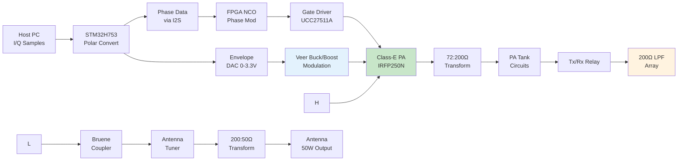
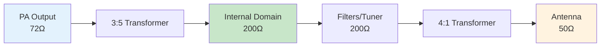
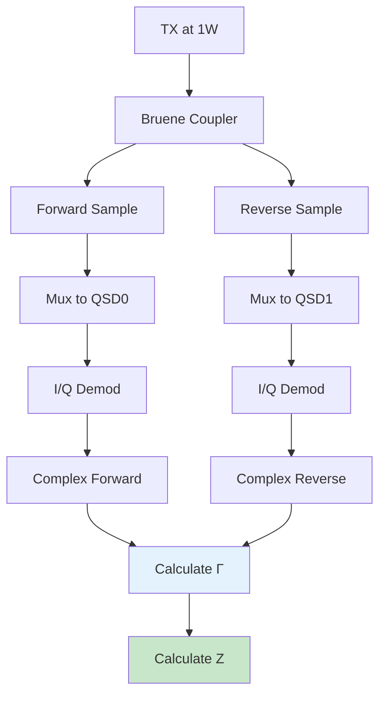

# NexRig: Transmitter Architecture
## Envelope Elimination and Restoration with Digital Control

**Document Version:** 1.0
**Date:** October 2025
**Supersedes:** Previous TX-ARCHITECTURE.md versions

---

## Table of Contents

1. [Introduction](#introduction)
2. [Architecture Overview](#architecture-overview)
3. [Envelope Elimination and Restoration (EER)](#envelope-elimination-and-restoration-eer)
4. [Veer Buck/Boost Envelope Modulator](#veer-buckboost-envelope-modulator)
5. [FPGA NCO and Phase Modulation](#fpga-nco-and-phase-modulation)
6. [Class-E Power Amplifier](#class-e-power-amplifier)
7. [Impedance Domain Architecture](#impedance-domain-architecture)
8. [Low-Pass Filter Array](#low-pass-filter-array)
9. [Antenna Impedance Measurement](#antenna-impedance-measurement)
10. [TX/RX Integration](#txrx-integration)
11. [Digital Pre-Distortion](#digital-pre-distortion)
12. [Performance Analysis](#performance-analysis)

---

## Introduction

The NexRig transmitter represents some rethinking of amateur radio
power amplifier design. Instead of traditional linear amplification
with its inherent inefficiency, NexRig implements **Envelope
Elimination and Restoration (EER)** - a technique that separates
amplitude and phase modulation to improve efficiency while maintaining
signal quality, moving these operations from the analog domain into
the digital domain.

### Design Philosophy

The transmitter design embraces several revolutionary principles:

**Efficiency Through Switching**: Both the power amplifier and
envelope modulator operate as switching circuits, achieving >80%
efficiency compared to 25-50% for linear designs.

**Digital Control Throughout**: From envelope generation via DAC to
phase modulation via FPGA NCO, digital control replaces analog
modulation circuits.

**Impedance Domain Optimization**: The transmitter operates at 200Ω
internally for superior filter performance and reduced current stress,
transforming to 50Ω only at the antenna interface.

**Zero-Voltage Switching**: All relay switching occurs with power
removed, extending relay life from 10⁵ to 10⁸+ operations.

**Vector Measurement Integration**: The transceiver does full complex
impedance measurement on the feed to the antenna, enabling
deterministic antenna tuning rather than trial-and-error, real power
output measurement, and simple VSWR display.

---

## Architecture Overview

### Signal Path Summary



The transmitter separates the signal into two paths:

1. **Amplitude Path**: Digital envelope → DAC → Veer modulator → PA supply voltage
2. **Phase Path**: Digital phase → FPGA NCO → Gate driver → PA switching

These paths recombine at the power amplifier to reconstruct the
transmitted signal with high efficiency.

---

## Envelope Elimination and Restoration (EER)

### Theoretical Foundation

EER, also known as the Kahn technique, decomposes any modulated signal
into amplitude and phase components:

```
RF_out(t) = A(t) × cos(ωt + φ(t))

Where:
- A(t) = instantaneous amplitude/envelope
- φ(t) = instantaneous phase
- ω = carrier frequency (2πf)
```

Traditional linear amplifiers maintain constant supply voltage while
varying current to create amplitude variations. This wastes power as
heat during low-amplitude portions of the signal.

EER instead:
1. Varies the PA supply voltage to track the envelope
2. Operates the PA as a switch (on/off only)
3. Achieves theoretical efficiency approaching 100%

### Implementation Architecture

**Signal Decomposition (Host PC)**:
```javascript
// Conceptual process (not actual code)
I/Q samples → magnitude = √(I² + Q²)
           → phase = atan2(Q, I)
```

**Envelope Path Characteristics**:
- Update rate: 48 kHz (48,000 samples/second)
- Resolution: 12-bit DAC (4096 levels)
- Bandwidth: DC to 5 kHz (sufficient for SSB)
- Dynamic range: 0-60V output (>35 dB)

**Phase Path Characteristics**:
- Update rate: 48 kHz phase modulation
- Carrier frequency: 1.8-30 MHz
- Phase resolution: 16-bit (0.0055° steps)
- Output: Square wave (no amplitude information)

### Synchronization Requirements

Critical to EER operation is precise time alignment between envelope
and phase paths:

```
Envelope path delay: ~50μs (Veer response time)
Phase path delay: <1μs (nearly instantaneous)

Solution: Digital delay line in FPGA
- Delays phase updates by 50μs
- Maintains perfect envelope/phase alignment
- Adjustable in 20ns increments
```

---

## Veer Buck/Boost Envelope Modulator

### Design Requirements

The envelope modulator must track audio-frequency amplitude variations
while providing the full 0-60V range needed for 50W output:

| Parameter | Requirement | Implementation |
|-----------|------------|----------------|
| Input voltage | 20V (USB-PD) | Direct from USB-PD rail |
| Output voltage | 0-60V | Buck (0-20V) / Boost (20-60V) |
| Output current | 3A peak | 50W into 72Ω load |
| Bandwidth | 5 kHz | Sufficient for SSB voice |
| Efficiency | >85% | Switching topology |
| Ripple | <100mV | Filtered by PA tank |

### Circuit Implementation

**Power Stage Components**:
- Controller: LM34936 automotive buck/boost regulator
- MOSFETs: 4× CSD19532Q5B (100V, 4mΩ) in H-bridge
- Inductor: 6.8μH, 11A saturation, low DCR
- Switching frequency: 500 kHz (15kΩ on RT pin)
- Output capacitor: 10μF/100V NP0 ceramic

**Control Loop**:
```
STM32 DAC (0-3.3V) → TLV9062 Error Amplifier → LM34936 FB Pin
                              ↑
                    Veer_out × (10k/190k) feedback

Closed-loop gain: 190k/10k = 19
Full scale: 3.3V × 19 = 62.7V (allows headroom)
```

**Current Limiting**:
- Sense resistor: 0.015Ω, 5W, Kelvin connection
- Filtering: 1kΩ + 10nF (16 kHz bandwidth)
- Limit threshold: 8A (133mV across sense resistor)
- Protection: Cycle-by-cycle current limiting

### Dynamic Performance

For typical SSB voice envelope:

```
Average speech power: 25% of PEP (12.5W average)
Average Veer voltage: √(12.5 × 72) = 30V
Peak Veer voltage: 60V (during voice peaks)
Crest factor: 10-15 dB typical

Efficiency improvement:
- Linear PA: 50W/120W = 42% efficiency
- EER PA: 50W/75W = 67% efficiency
- Power saved: 45W (37.5% reduction)
```

### PCB Layout Considerations

Critical for switching converter performance:

1. **Power Loop Minimization**: Keep buck/boost power MOSFETs,
   inductor, and output capacitor in tight loop
2. **Ground Plane**: Solid ground under entire converter
3. **Gate Drive**: Short traces from controller to MOSFET gates
4. **Thermal Relief**: Adequate copper for MOSFET heat dissipation
5. **Output Filtering**: Place output capacitor close to PA supply input

---

## FPGA NCO and Phase Modulation

### NCO Architecture

The FPGA implements a high-resolution numerically controlled
oscillator:

```
Components:
- 32-bit phase accumulator
- 32-bit frequency control word (FCW)
- 16-bit phase modulation input
- Square wave output generator

Operation each clock cycle:
1. Phase_acc = Phase_acc + FCW + Phase_mod
2. Output = MSB of Phase_acc (square wave)
```

### Frequency Generation

**Frequency Resolution**:
```
FPGA clock: 120 MHz (from 40 MHz TCXO × 3 PLL)
Resolution: 120 MHz / 2³² = 0.028 Hz
Tuning range: 0 to 60 MHz (Nyquist limit)
Practical range: 1.8-30 MHz (HF bands)
```

**Frequency Control Word Calculation**:
```
FCW = (F_desired × 2³²) / F_clock
Example for 14.200 MHz:
FCW = (14.2 × 10⁶ × 2³²) / 120 × 10⁶ = 508,559,958
```

### Phase Modulation Implementation

Phase modulation updates arrive via I2S from STM32:

```
I2S Protocol:
- 16-bit phase offset value
- 48 kHz update rate
- Latency: <20μs
- Format: Binary offset, 360° = 65536 counts

Phase resolution: 360°/65536 = 0.0055°
More than adequate for any amateur mode
```

The FPGA also supports a SPI interface for control and monitoring of
NCOs and similar register values.

### Output Signal Generation

The NCO produces a square wave output:

```
Advantages of square wave drive:
1. Maximum gate drive voltage (0V or 3.3V)
2. Fast transitions (<2ns rise/fall)
3. No amplitude modulator needed
4. Simplified gate driver design
5. Inherent 50% duty cycle

Harmonic content handled by:
- PA tank circuit (Q=10-20)
- Output low-pass filters
- Antenna tuner components
```

### Clock Distribution

```
40 MHz TCXO → FPGA PLL → 120 MHz system clock
                        → NCO module
                        → SPI interface
                        → Delay compensation
                        → Synchronization logic
```

---

## Class-E Power Amplifier

### Design Principles

Class-E operation achieves high efficiency through Zero Voltage
Switching (ZVS):

```
Ideal Class-E conditions:
1. Switch turns ON when V_drain = 0
2. Switch turns OFF when I_drain = 0
3. No simultaneous V and I → No power dissipation
4. Efficiency approaches 100% (practically 85-90%)
```

### PA MOSFET Selection

**Device**: IRFP250NPBF
- V_DSS: 200V (3× margin at 60V supply)
- I_D: 30A (10× margin for 3A peak)
- R_DS(on): 0.075Ω at 10V gate drive
- C_oss: 385pF (affects tank tuning)
- Power dissipation: 214W (massive margin)

### Load Network Design

The PA sees an optimal load of 72Ω:

```
For 50W output at 60V supply:
R_opt = V²/P = 60²/50 = 72Ω

Peak voltage: 60V × π = 188V (within 200V rating)
Peak current: 50W/60V × π = 2.6A (well within 30A rating)
```

**PA Tank Circuit**:
```
Components per band:
- L_tank: Chosen for resonance with C_oss at band center
- C_tank: High-Q NP0/C0G ceramic or mica
- Q_loaded: 10-20 (compromise between efficiency and bandwidth)

Example for 20m (14 MHz):
- C_oss = 385pF
- L_tank = 335nH for resonance
- Bandwidth = 14 MHz / 15 = 0.93 MHz
```

### Gate Drive Circuit

**Driver IC**: UCC27511A
- Output current: 4A source, 8A sink
- Rise time: <20ns into 1.8nF load
- Supply voltage: 12V (from main rail)
- Propagation delay: 20ns typical

**Transformer Coupling**:
```
Why transformer coupling?
1. Provides DC isolation
2. Allows optimal gate bias voltage
3. Prevents ground loops
4. Improves switching speed

Transformer specifications:
- Core: Fair-Rite 2843000202 binocular
- Primary: 3 turns bifilar #26 AWG
- Secondary: 5 turns bifilar #26 AWG
- Coupling coefficient: >0.98
- Leakage inductance: <50nH
```

**Gate Circuit Components**:
- Series resistor: 6.8Ω (dampens ringing)
- Gate protection: 15V Zener diode (may be added)
- Turn-off resistor: 1kΩ to ground (may be added)
- Gate charge: 130nC at 10V

### Thermal Management

Power dissipation at 50W output:

```
Efficiency: 85% (conservative estimate)
Input power: 50W / 0.85 = 59W
Dissipation: 59W - 50W = 9W

Thermal resistance calculation:
- R_JC (junction-case): 0.45°C/W
- R_CS (case-sink): 0.5°C/W (with thermal compound)
- R_SA (sink-ambient): 2°C/W (modest heatsink)
- Total: 2.95°C/W

Temperature rise: 9W × 2.95°C/W = 27°C
At 25°C ambient: T_junction = 52°C (well below 150°C max)
```

---

## Impedance Domain Architecture

### Three-Domain Strategy

The transmitter operates in three distinct impedance domains:



### 72Ω PA Output Domain

**Rationale**:
```
Traditional 50Ω PA for 50W at 60V:
- Load = 50Ω
- Current = √(50W/50Ω) = 1.0A RMS = 2.8A peak
- Voltage = 60V supply utilized poorly

Optimized 72Ω PA for 50W at 60V:
- Load = 72Ω (ideal for 60V supply)
- Current = √(50W/72Ω) = 0.83A RMS = 2.6A peak
- Voltage = 60V supply fully utilized
```

Benefits:
- 17% lower peak current
- Reduced I²R losses
- Better MOSFET utilization
- Improved efficiency

### 200Ω Internal Domain

All filters, PA tanks, and tuner components operate at 200Ω:

**Filter Benefits**:
```
For same cutoff frequency:
L_200Ω = 4 × L_50Ω (larger, higher Q)
C_200Ω = C_50Ω / 4 (smaller, cheaper)

Q improvement: Q = R/X_L
Q_200Ω = 4 × Q_50Ω
```

**Current Reduction**:
```
At 50W:
I_50Ω = √(50W/50Ω) = 1.0A RMS
I_200Ω = √(50W/200Ω) = 0.5A RMS

Relay benefits:
- 50% current reduction
- 75% power handling reduction (I²R)
- Smaller, cheaper relays usable
```

### Impedance Transformers

**72Ω to 200Ω Transformer (T1)**:
```
Specifications:
- Core: FT140-43 or FT140-61
- Primary: 3 turns #18 AWG (72Ω)
- Secondary: 5 turns #18 AWG (200Ω)
- Turns ratio: 3:5 (impedance ratio 9:25 = 72:200)
- Power handling: 100W continuous

Efficiency: >97% (low turns count minimizes loss)
```

**200Ω to 50Ω Transformer (T2)**:
```
Specifications:
- Core: FT140-43 or equivalent
- Primary: 16 turns #18 AWG (200Ω)
- Secondary: 8 turns #18 AWG (50Ω)
- Turns ratio: 2:1 (impedance ratio 4:1)
- Insertion loss: <0.1 dB
```

---

## Low-Pass Filter Array

### Filter Architecture

The 200Ω domain enables superior filter performance:

```
Each band filter:
- Topology: 5th-order elliptic
- Impedance: 200Ω throughout
- Cutoff: 1.5× highest band frequency
- Stopband: >40 dB at 2nd harmonic
- Insertion loss: <0.3 dB
```

### Component Selection

**Inductor Advantages at 200Ω**:
```
Example for 14 MHz LPF:
- 50Ω design: L = 0.57μH, Q limited by small value
- 200Ω design: L = 2.27μH, Q much higher

Toroid selection:
- 50Ω: T50-6 core, 8 turns
- 200Ω: T50-6 core, 16 turns
Higher turns = better Q = lower loss
```

**Capacitor Advantages**:
```
200Ω design uses 1/4 the capacitance:
- Smaller physical size
- Lower cost
- Better temperature stability (NP0/C0G feasible)
- Higher voltage rating in same package
```

### Filter Switching

**Reed Relay Implementation**:
```
Relay type: TQ2-5V DPDT
- Coil: 5V, 20mA (STM32 compatible via driver)
- Contacts: 0.5A, 125V rating
- At 200Ω, 50W: I = 0.5A, V = 100V (within ratings)

Switching topology:
- Input: Common to all filters
- Output: Selected filter to antenna path
- Unused filters: Terminated in 200Ω load
- Always zero voltage switching (PA off)
```

### Band-Specific Designs

The transmitter includes eight relay-switched low-pass filters
optimized for the 200Ω impedance domain:

|Band|Frequency Range|L (Series)|C (Shunt 1)|C (Shunt 2)|C (Series)|Relay|
|---|---|---|---|---|---|---|
|**160m**|1.8-2.0 MHz|1.5µH|350pF|220pF|330pF|K1601|
|**80m**|3.5-4.0 MHz|820nH|220pF|330pF|180pF|K1602|
|**60m**|5.3-5.4 MHz|620nH|150pF|240pF|130pF|K1603|
|**40m**|7.0-7.3 MHz|470nH|220pF|180pF|100pF|K1606|
|**30m**|10.1-10.15 MHz|330nH|82pF|150pF|68pF|K1607|
|**20m**|14.0-14.35 MHz|240nH|56pF|91pF|47pF|K1608|
|**17/15m**|18.068-21.45 MHz|180nH|39pF|33pF|33pF|K1604|
|**12/10m**|24.89-29.7 MHz|130nH|33pF|24pF|27pF|K1605|

### Filter Topology

Each filter implements a modified pi-network configuration optimized
for the 200Ω impedance domain:

![[Pasted image 20251028170813.png]]

This topology provides:

- Stopband attenuation: >40 dB at second harmonic
- Passband insertion loss: <0.3 dB
- Return loss: >20 dB in-band
- Power handling: 100W continuous at 200Ω
### Component Selection at 200Ω

Operating at 200Ω rather than the traditional 50Ω provides significant
component advantages:

**Inductors**: Values are 4× larger than equivalent 50Ω designs,
enabling higher Q factors and easier winding. The larger inductance
values (240nH to 1.5µH) are practical to implement with air-core or
toroidal inductors while maintaining excellent Q.

**Capacitors**: Values are 4× smaller than 50Ω equivalents, allowing
use of high-quality NP0/C0G ceramic capacitors throughout. The reduced
capacitance requirements (24pF to 350pF) eliminate the need for mica
or other expensive high-voltage capacitors.

### Filter Switching Implementation

**Relay Selection**: TQ2-5V DPDT reed relays provide reliable
switching with minimal insertion loss. Both poles are paralleled to
handle the 0.5A RMS current at 50W in the 200Ω domain.

**Switching Architecture**: Each filter connects between common input
and output buses. Unselected filters remain disconnected, preventing
interaction and maintaining optimal stopband performance.

**Zero-Voltage Switching Protocol**: Filter selection occurs only with
Veer at 0V, ensuring no voltage or current through relay contacts
during switching. This extends relay life beyond 10⁸ operations and
eliminates hot-switching derating requirements.

---

## Antenna Impedance Measurement

### Bruene Directional Coupler

Located in the 200Ω domain after all filters:

```
Specifications:
- Primary: 200Ω transmission line (1 turn through core)
- Secondary: 2 turns center-tapped
- Core: FT50-43 ferrite toroid
- Coupling: -26 dB (voltage ratio 1:20)
- Directivity: >30 dB
```

**Voltage Divider Networks**:
```
Forward and reverse samples need scaling for QSD input:

At 50W in 200Ω domain:
- V_line = √(50W × 200Ω) = 100V RMS = 141V peak
- V_coupled = 141V / 20 = 7V peak
- After 47k:220Ω divider = 32mV peak (safe for QSD)
```

### Vector Measurement Process

During transmit at reduced power (1W):



### Complex Impedance Calculation

```
Measured values:
V_fwd = I_fwd + j·Q_fwd (from QSD0)
V_rev = I_rev + j·Q_rev (from QSD1)

Reflection coefficient:
Γ = V_rev / V_fwd (complex division)
|Γ| = magnitude, ∠Γ = phase

Antenna impedance at 200Ω reference:
Z_200 = 200Ω × (1 + Γ)/(1 - Γ)

Convert to 50Ω reference:
Z_50 = Z_200 / 4 = R + jX
```

### Deterministic Tuning

With complex impedance known:

```
Example: Antenna measures 25 + j35Ω at 14.2 MHz

1. Cancel reactance:
   X = +35Ω (inductive)
   Add series C = 1/(2π × 14.2MHz × 35Ω) = 320pF

2. Match resistance:
   R = 25Ω (after reactance cancelled)
   L-network: Shunt L = 265nH, Series C = 225pF

3. Set relays:
   - Select C_series = 320pF + 225pF = 545pF
   - Select L_shunt = 265nH

4. Verify:
   Final Z should be 50 + j0Ω (perfect match)
```

Total tuning time: ~50ms including measurement and relay switching.

---

## TX/RX Integration

### Shared Signal Path

The 200Ω domain components serve both transmit and receive:

```mermaid
graph LR
    subgraph TX Mode
        A[PA Output] --> C[PA Tanks<br/>200Ω]
	    C --> LPFs[LPFs<br/>200Ω]
        LPFs --> bruene[Bruene Sampler]
		bruene --> tuner[Antenna Tuner]
    	tuner --> T20050[200:50 ohm]
		T20050 --> D[Antenna]
    end

    subgraph RX Mode
        E[Antenna] --> G[LPFs]
        G --> H[Tx/Rx Relay]
		H --> [Rx]
    end

    style B fill:#e3f2fd
    style F fill:#e3f2fd
```

Benefits of sharing:
- TX filters provide RX band-limiting
- Single set of components
- Automatic RX protection during TX

### T/R Switching

**Reed Relay**: TQ2-5V DPDT
```
Configuration:
- Both poles paralleled for 200Ω path
- TX position: PA → Filters → Antenna
- RX position: Antenna → Filters → RX input
- Switching time: 5ms maximum
- Isolation: >60 dB at 30 MHz
- Only zero voltage switching
```

### Zero-Voltage Switching Protocol

Zero-voltage switching benefits:
- No contact arcing
- No RFI generation
- 1000× life extension (10⁸ operations)
- Smaller relays usable

---

## Digital Pre-Distortion

### Linearization Strategy

Even switching amplifiers have non-linearities requiring correction:

```
Sources of distortion:
1. Veer modulator bandwidth limitations
2. Gate drive transition asymmetry
3. PA load impedance variation with frequency
4. Envelope/phase path delay mismatch
```

### Measurement Path

```
TX output → Attenuator → RX input → Demodulation → Error detection

Comparison:
- Original I/Q (from host)
- Received I/Q (from PA output)
- Error vector = Received - Original
```

### Pre-Distortion Algorithm

**Polynomial Model**:
```
Basic model:
Output = Input + α₃·Input³ + α₅·Input⁵

Where coefficients compensate for:
- α₃: Third-order intermodulation
- α₅: Fifth-order intermodulation

Adaptation:
- Transmit two-tone test signal
- Measure IMD products
- Adjust coefficients to minimize IMD
- Store per band and power level
```

### Real-Time Correction

```
During transmission:
1. Apply pre-distortion to I/Q samples
2. Monitor PA output via RX path
3. Calculate error metrics
4. Update coefficients slowly (1 Hz rate)
5. Maintain IMD below -30 dBc
```

Expected improvement:
- Without DPD: -25 dBc IMD typical
- With DPD: -35 to -40 dBc achievable
- Spectral regrowth: 10-15 dB reduction

---

## Performance Analysis

### Efficiency Analysis

**Power Budget at 50W Output**:

```
Traditional Class-AB Linear:
- DC input: 12V × 10A = 120W
- RF output: 50W
- Efficiency: 50/120 = 42%
- Dissipation: 70W (large heatsink required)

NexRig EER System:
- Veer efficiency: 85% (buck/boost)
- PA efficiency: 85% (Class-E)
- Transformer loss: 3% (two transformers)
- Filter loss: 2%
- Overall: 0.85 × 0.85 × 0.97 × 0.98 = 69%

- DC input: 50W / 0.69 = 72W
- From USB-PD: 72W / 0.85 = 85W at 20V
- Current from USB-PD: 85W / 20V = 4.25A
- Dissipation: 22W (modest cooling)
```

### Spectral Purity

**Harmonic Performance**:

| Harmonic | PA Output | After LPF | Specification |
|----------|-----------|-----------|---------------|
| 2nd | -20 dBc | -65 dBc | <-43 dBc |
| 3rd | -25 dBc | -70 dBc | <-43 dBc |
| 4th | -30 dBc | -75 dBc | <-43 dBc |
| 5th | -35 dBc | -80 dBc | <-50 dBc |

Exceeds FCC requirements by >20 dB margin.

### Intermodulation Distortion

**Two-Tone Design Predicted Results**:

```
Test conditions:
- Frequency: 14.2 MHz
- Tones: 1 kHz and 2 kHz
- Power: 50W PEP

Without DPD:
- 3rd order IMD: -28 dBc
- 5th order IMD: -35 dBc

With DPD:
- 3rd order IMD: -38 dBc
- 5th order IMD: -45 dBc
```

### Dynamic Range

**Envelope Modulator**:
```
Maximum output: 60V
Minimum output: 1V (practical limit)
Dynamic range: 20 × log(60/1) = 35.6 dB

Resolution: 12-bit DAC = 72 dB theoretical
Practical: ~50 dB (limited by noise)
```

**Phase Modulator**:
```
Resolution: 16-bit = 96 dB theoretical
Phase noise: -130 dBc/Hz at 1 kHz offset
Practical: Limited by TCXO phase noise
```

### Bandwidth and Modulation Capability

**Supported Modes**:

| Mode | Bandwidth | Envelope BW | Phase BW | Supported |
|------|-----------|-------------|----------|-----------|
| CW | 500 Hz | DC (on/off) | 500 Hz | Yes |
| SSB | 3 kHz | 3 kHz | 3 kHz | Yes |
| AM | 6 kHz | 6 kHz | None | Yes |
| PSK31 | 31 Hz | Constant | 31 Hz | Yes |
| FT8 | 50 Hz | Constant | 50 Hz | Yes |
| RTTY | 250 Hz | Constant | 250 Hz | Yes |

Veer's 5 kHz bandwidth limits wideband modes but covers all common
amateur modes.

---

## Thermal Management

### Power Dissipation Distribution

At 50W output, approximately 22W dissipated:

```
Component dissipation:
- PA MOSFET: 7W (main heat source)
- Veer MOSFETs: 6W (distributed across 4 devices)
- Veer inductor: 3W (I²R losses)
- Transformers: 2W (core and copper losses)
- Filters: 2W (inductor losses)
- Miscellaneous: 2W
```

### Cooling Strategy

**PA MOSFET Heatsink**:
```
Required thermal resistance:
- Maximum junction temp: 150°C
- Derate to: 100°C for reliability
- Ambient: 35°C
- Temperature rise budget: 65°C
- At 7W: R_total = 65°C / 7W = 9.3°C/W

Heatsink selection:
- Small extruded aluminum
- 50mm × 50mm × 25mm typical
- Natural convection adequate
- Fan optional for continuous duty
```

**Veer Converter Cooling**:
```
MOSFETs on PCB copper pour:
- 1 oz copper minimum
- 4 cm² per MOSFET
- Thermal vias to ground plane
- Distributed layout minimizes hot spots
```

### Temperature Monitoring

STM32 monitors critical temperatures:
- PA MOSFET heatsink (NTC thermistor)
- Veer inductor (NTC thermistor)
- Board ambient (internal STM32 sensor)

Protection thresholds:
- Warning at 80°C
- Power reduction at 90°C
- Shutdown at 100°C

---

## Design Trade-offs and Rationale

### Why EER Instead of Linear?

**Alternatives Considered**:

**Traditional Class-AB**:
- Pros: Simple, well-understood, good linearity
- Cons: 40% efficiency, large heatsink, high current

**Class-D/E Direct**:
- Pros: High efficiency
- Cons: Complex modulation, poor spectral purity

**Doherty Architecture**:
- Pros: Better efficiency than Class-AB
- Cons: Complex combining, narrowband

**EER Advantages**:
- 67% overall efficiency (1.6× better than linear)
- Smaller heatsink requirements
- Digital control throughout
- Inherent voltage/current limiting
- Natural integration with SDR architecture

### Why 200Ω Internal Domain?

**Alternative**: Keep everything at 50Ω
- Pros: Standard impedance throughout
- Cons: High currents, lower filter Q, larger components

**200Ω Benefits Quantified**:
- Current reduced 50% (I²R losses down 75%)
- Filter Q improved 4× (sharper rolloff)
- Capacitors reduced 75% (smaller, cheaper)
- Relay stress reduced (smaller relays usable)
- PCB traces narrower (less board space)

### Why Separate Power and Data?

**Alternative**: USB 3.0 for both
- Pros: Single cable
- Cons: Limited to 15W, ground loop risk, EMI issues

**Separate Connections Provide**:
- 100W power capability (USB-PD)
- Complete ground isolation
- No USB driver issues
- Works with any Ethernet device
- Power and data independence

---

## Future Enhancements

### Potential Improvements

**Envelope Modulator Upgrade**:
- GaN FETs for Veer (higher frequency, better efficiency)
- Digital control loop (FPGA-based PWM)
- Adaptive pre-emphasis for wider bandwidth

**PA Enhancement**:
- Multiple MOSFET options for different bands
- Adaptive bias for Class-AB/E selection
- Automatic load impedance compensation

**Measurement Extensions**:
- Time-domain reflectometry mode
- Return loss bridge for antenna analysis
- Built-in two-tone generator

### Software Enhancements

All implementable without hardware changes:

**Advanced Predistortion**:
- Neural network-based adaptation
- Memory effect compensation
- Temperature-dependent correction

**New Modulation Modes**:
- OFDM experiments
- MSK/GMSK for packet
- Adaptive modes based on conditions

**Diagnostic Capabilities**:
- Continuous spectral purity monitoring
- Automatic antenna system verification
- Component aging compensation

---

## Conclusion

The NexRig transmitter architecture demonstrates that amateur radio
equipment can achieve commercial-grade performance through intelligent
system design. The EER approach provides efficiency while maintaining
excellent signal quality, digital software-defined flexibility, and
the 200Ω impedance domain optimization reduces component stress while
improving filter performance.

Key innovations include:

1. **EER architecture** achieves 67% efficiency vs 42% for traditional linear
2. **200Ω internal domain** reduces current by 50% and improves filter Q by 4×
3. **Digital control throughout** enables software flexibility and precise operation
4. **Vector impedance measurement** provides deterministic antenna tuning
5. **Zero-voltage switching** extends relay life by 1000×

The architecture's modularity, comprehensive monitoring, and
software-defined flexibility create a platform that can evolve with
changing amateur radio requirements while maintaining the reliability
expected of RF power systems.

Integration with the receiver path through shared components
demonstrates elegant design reuse, while the separation of power and
data paths ensures robust operation in diverse environments.

This transmitter design proves that high efficiency, excellent
spectral purity, and advanced features are achievable in an
open-source platform, inviting continued innovation from the amateur
radio community.

---

**Document Revision**: 1.0
**Last Updated**: October 2025
**Related Documents**:
- SYSTEM-OVERVIEW.md - System architecture and key innovations
- RX-ARCHITECTURE.md - Receiver design details
- SYSTEM-INTEGRATION.md - Component interconnections and protocols
- CONSTRUCTION-TESTING.md - Assembly and validation procedures

---

*End of TX-ARCHITECTURE.md*
