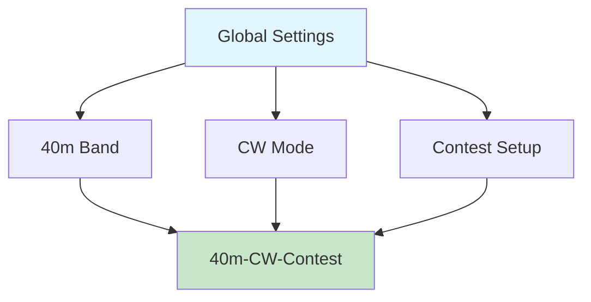

# NexRig: Open-Source Ham Radio SDR Transceiver System
## Overview & Core Concepts

### What is NexRig?

NexRig is an ambitious open-source project that reimagines how we
interact with ham radio transceivers. Instead of the knobs, buttons,
and menu diving that have defined radio interfaces for decades, NexRig
presents a browser-based interface built around a revolutionary
concept called "setboxes."

Think of it as bringing ham radio into the modern computing age -
where your radio's interface is as flexible and powerful as the
software on your computer, but still maintains the real-time
performance demands of RF communication.

The entire project uses the MIT License, covering everything from
hardware designs and PCB layouts to software source code. This isn't
just another commercial radio with a fancy display - it's a
community-driven platform designed to push ham radio technology
forward for everyone.

### The Big Idea: Setboxes

Here's where NexRig gets interesting. Traditional radios force you to
think in terms of physical controls - turn this knob for frequency,
press that button for mode, flip this switch for antenna selection.
But why should software-defined radio be limited by the metaphors of
analog hardware?

NexRig introduces "setboxes" - think of them as smart presets that can
inherit settings from each other, just like object-oriented
programming. Instead of having separate "band" and "mode" controls,
you might have a setbox called "40m-CW-Contest" that inherits basic
40-meter settings from a parent "40m" setbox, adds CW-specific
parameters from a "CW" setbox, and then layers on contest-specific
configurations.

This hierarchy means you can set your antenna preferences once in
"Global Settings," define band-specific power levels in "40m Band,"
configure CW tone preferences in "CW Mode," and create
contest-specific memory channels in "Contest Setup." When you activate
"40m-CW-Contest," it automatically combines all these inherited
settings with any overrides you've defined specifically for that
configuration.

### Why This Matters

Traditional radio interfaces suffer from what we might call "control
soup" - every setting lives at the same level, making it hard to
organize your preferences logically. Want to use different antennas
for 160m versus other bands? You'll be manually switching antennas
every time you change bands. Prefer different power levels for CW
versus SSB? Hope you remember to adjust that knob every time you
change modes.

Setboxes solve this by letting you organize your radio's behavior
hierarchically. Set up your preferences once, then let the inheritance
system handle the details. The result is a radio that adapts to your
operating style instead of forcing you to adapt to its limitations.

### System Overview

NexRig consists of three main components that work together
seamlessly:

**Hardware Platform**: Built around an STM32H753 microcontroller
running at 480MHz with a full megabyte each of flash and RAM. This
isn't your typical Arduino project - we're talking serious
computational power running Zephyr RTOS. The RF hardware handles ten
HF bands (160m through 10m) with a sophisticated envelope elimination
and restoration (EER) power amplifier capable of 100 watts output.

**Embedded Software**: Written in modern C++20, this handles the
real-time RF control, basic DSP processing, and serves as a web
server. It presents itself to your computer as a USB ethernet device
with a captive portal, so there's no driver installation or network
configuration hassles.

**Browser Application**: This is where the magic happens. Using modern
JavaScript and HTML5, the browser handles advanced DSP, the setbox
management system, and provides rich visualizations like waterfall
displays and spectrum analysis. The interface runs entirely in your
browser - Chrome, Edge, or Safari - with no plugins or special
software required.

The beauty of this architecture is its simplicity from the user's
perspective. Plug in the USB cable, open your browser, and you're
ready to operate. But under the hood, you have access to computational
power and interface flexibility that would be impossible with
traditional radio architectures.

### Key Design Principles

**Inheritance Over Configuration**: Rather than configuring every
parameter for every situation, set up logical hierarchies and let
inheritance handle the complexity. Your "DX" setbox can inherit from
your "20m" setbox, which inherits from your "HF" setbox, which
inherits from your global preferences.

**Browser-Native Interface**: No custom applications to install, no
drivers to manage, no compatibility worries across different operating
systems. If it runs a modern browser, it can run NexRig.

**Community-Driven Development**: The entire project is open source
with permissive licensing specifically to encourage community
contributions, modifications, and improvements. This is ham radio,
after all - we're supposed to be experimenting and learning.

**Real-Time Performance**: Despite the web-based interface, NexRig
maintains the real-time performance requirements of RF operation
through careful architecture and efficient protocols.

### The Vision

NexRig isn't just another SDR project - it's an attempt to demonstrate
what ham radio interfaces could become if we stopped thinking in terms
of analog radio metaphors and started thinking in terms of modern
software design patterns.

Imagine having complete recordings of every QSO with automatic digital
mode decoding, multiple simultaneous receive frequencies with
independent waterfalls, or antenna switching that automatically adapts
to your operating patterns. These capabilities become natural
extensions of the setbox paradigm rather than complex features bolted
onto traditional radio designs.

The goal is to create a platform that grows with you as an operator,
adapts to your preferences, and provides the kind of deep
configurability that makes ham radio uniquely satisfying - but without
the traditional complexity that makes advanced features intimidating
to explore.
