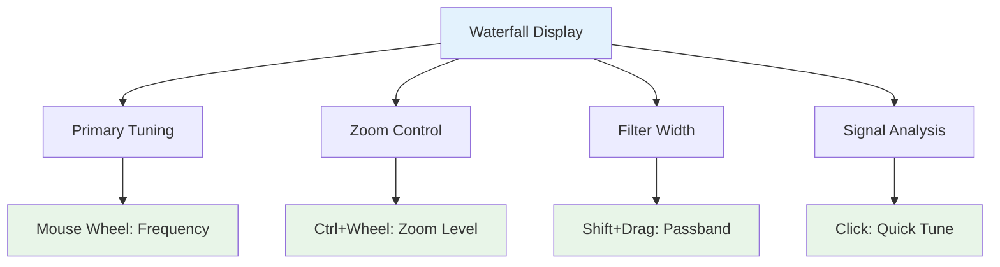
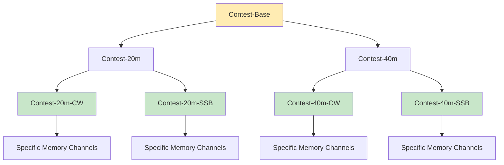

# NexRig: User Experience & Features
## Interface Design, Workflows, and Operating Features

### The Browser-Native Interface

Opening NexRig feels nothing like traditional radio software. There's
no installation process, no driver hunting, no compatibility concerns
across operating systems. Plug in the USB cable, open Chrome or
Safari, navigate to the captive portal, and you're immediately
presented with a modern, responsive interface that feels more like a
professional audio application than a ham radio.

The interface adapts to your screen size and usage patterns. On a
large monitor, you might have multiple waterfall displays showing
different zoom levels, constellation plots for digital modes, and
audio analysis tools. On a tablet, the interface reorganizes to
prioritize the most commonly used controls while keeping advanced
features accessible through intuitive gestures.

### Waterfall-Centric Operation

The waterfall display serves as far more than just a spectrum
visualization - it becomes a primary control surface. Mouse wheel
scrolling tunes frequency with pixel-level precision, while modifier
keys enable different functions directly on the graphical display.

Multiple waterfall displays can show different perspectives
simultaneously. A wide-band view might cover the entire 40-meter band
while a detailed view focuses on the immediate area around your tuning
frequency. Each display can use different color schemes optimized for
different types of signal analysis.

### Setbox Workflow in Practice

Let's walk through a realistic operating scenario to show how setboxes
transform the user experience. Imagine you're preparing for the ARRL
DX Contest and want to set up configurations for different bands and
modes.

**Setting Up Base Configurations**: Start by creating a "Contest-Base"
setbox that defines common contest settings - perhaps reduced power
for battery operation, specific antenna selections, and your contest
station callsign configuration. This becomes a parent setbox that
other configurations inherit from.

**Band-Specific Adjustments**: Create "Contest-20m" and "Contest-40m"
setboxes that inherit from "Contest-Base" but add band-specific
antenna selections, power levels optimized for each band's propagation
characteristics, and frequency memories for each band's contest
segments.

**Mode-Specific Refinements**: Add "Contest-20m-CW" and
"Contest-20m-SSB" setboxes that inherit from "Contest-20m" but
configure mode-specific parameters like CW tone frequency, transmit
audio equalization, or AGC settings optimized for weak signal work
versus pile-up busting.

**Live Operation**: During the contest, switching between
"Contest-20m-CW" and "Contest-40m-SSB" instantly reconfigures
everything - antenna selection, power level, audio processing,
waterfall color scheme, even the keyboard shortcuts active for that
mode. No knob turning, no menu diving, no forgetting to switch
antennas.

### Inheritance Inspector and State Management

One of NexRig's most powerful features is making the setbox
inheritance system completely transparent. When you adjust any
control, the interface shows exactly where that setting's value comes
from in the inheritance hierarchy.

Suppose you're adjusting transmit power and notice it's set to 50
watts. The inheritance inspector might show: "Power Level: 50W
(inherited from Contest-Base → overridden in Contest-20m → using
default from Contest-20m-CW)". This transparency makes it easy to
understand why settings have particular values and where to make
changes for different effects.

The interface clearly distinguishes between the live operating state
and saved setbox configurations. When you modify a parameter from its
saved value, the control changes color and displays a modification
indicator. You can then choose to:

- **Save**: Update the current setbox with your live changes
- **Save As**: Create a new child setbox inheriting from the current
  one
- **Revert**: Discard changes and reload the saved state

This workflow encourages experimentation while preventing accidental
overwrites of carefully configured setboxes.

### Advanced Visualization and Analysis

Because significant DSP processing happens in the browser, NexRig can
provide visualization and analysis tools that would be impossible in
traditional hardware radios.

**Constellation Diagrams**: For digital modes like PSK31 or FT8,
real-time constellation plots provide immediate feedback on signal
quality and decoding performance. The plots update in real-time,
showing the effects of propagation changes, interference, or equipment
adjustments.

**Audio Analysis Tools**: Switchable oscilloscope and spectrum
analyzer views of demodulated audio help with precise adjustment of
receive and transmit audio equalization. These tools are invaluable
for optimizing digital mode performance or adjusting SSB audio
characteristics.

**Multi-Domain Signal Analysis**: The interface can simultaneously
display time-domain, frequency-domain, and statistical analysis of
received signals, providing insights that help with everything from
antenna tuning to interference identification.

### Memory and Logging Systems

Traditional memory channels become much more powerful in the setbox
paradigm. Instead of just storing frequency and mode, a NexRig memory
can capture the complete operating state - antenna selections, DSP
settings, power levels, even waterfall color schemes.

**Tagged Memory System**: Memories include arbitrary tags, colors,
creation timestamps, and usage tracking. You might tag memories with
"DX", "Contest", "Ragchew", or "EmComm" and then filter displays to
show only relevant memories for your current activity.

**Complete State Recording**: The system maintains a chronological log
of all state changes with replay capability. This feature proves
invaluable for debugging equipment problems, analyzing your operating
patterns, or simply understanding how propagation changes affected
your station configuration choices.

**Voice Memory Integration**: Voice memories integrate naturally with
the setbox system. Record voice snippets tagged with specific modes,
bands, or activities. The system can automatically select appropriate
audio processing and equalization based on the current setbox
configuration.

### Multi-Modal Control Integration

NexRig leverages the full range of modern input methods rather than
forcing everything through point-and-click interfaces.

**Keyboard-Centric Operation**: Comprehensive keyboard shortcuts
provide rapid access to all major functions. Power users can operate
almost entirely from the keyboard, with shortcuts that adapt based on
the current mode and band selection.

**Gesture-Based Controls**: On touch devices, intuitive gestures
handle common operations. Pinch-to-zoom on waterfall displays, swipe
gestures for quick band changes, or long-press actions for accessing
secondary functions.

**Context-Sensitive Interfaces**: The interface adapts to your current
activity. When tuning CW signals, the controls emphasize tone
frequency and keying characteristics. During SSB operation, audio
processing and microphone controls become prominent.

### Advanced Features and Capabilities

**Multiple Simultaneous Receive Points**: The browser can process
multiple independent receive frequencies from the same I/Q data
stream, each with independent filtering, demodulation, and display.
Monitor the calling frequency while working a net, or keep an ear on
emergency frequencies during normal operation.

**Adaptive Filtering and Processing**: Create notch filters of
arbitrary width and depth directly on the waterfall display. Drag to
position, scroll to adjust depth, modifier keys to change bandwidth.
The system remembers these filters in the appropriate setboxes for
automatic application in similar situations.

**Automatic Signal Processing**: CW reception can automatically tune
to your preferred tone frequency. SSB audio processing adapts to voice
characteristics or band conditions. Digital mode decoding happens
continuously in the background with results displayed in real-time.

**Antenna and Tuner Integration**: The system manages antenna
switching and tuner settings as part of the setbox inheritance system.
Define antenna preferences globally, override them for specific bands
or modes, and let the system handle the switching automatically.

### Development and Customization

The browser-based architecture makes customization and enhancement
much more accessible than traditional radio firmware modification. Web
developers can contribute interface improvements using familiar tools
and frameworks.

The setbox data format uses standard JSON, making it easy to create
external tools for setbox management, backup, or sharing
configurations between operators. Advanced users can manipulate their
configurations programmatically or integrate NexRig with other station
automation systems.

The open-source nature means the entire ham community can contribute
improvements, from bug fixes and feature additions to completely new
interface paradigms that leverage the flexible setbox foundation.

This combination of powerful core concepts, modern interface design,
and community-driven development creates a platform that can evolve
with the changing needs of ham radio while maintaining the real-time
performance and reliability that RF communication demands.
